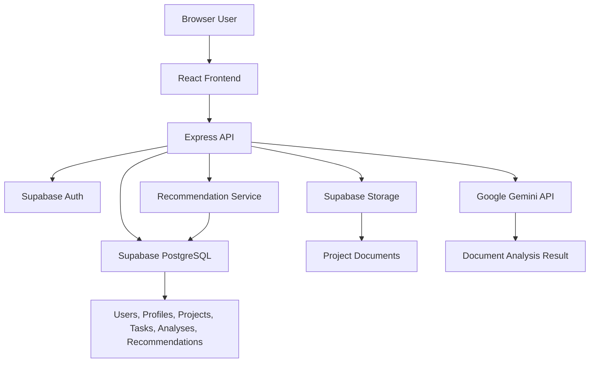
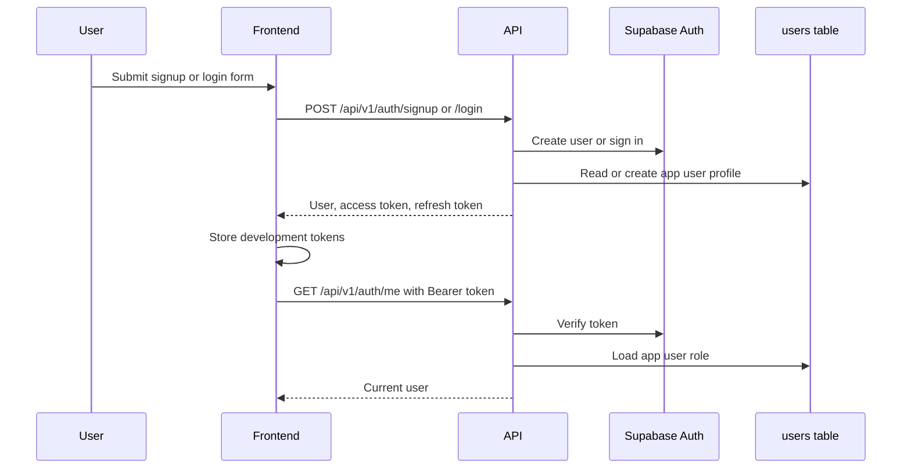
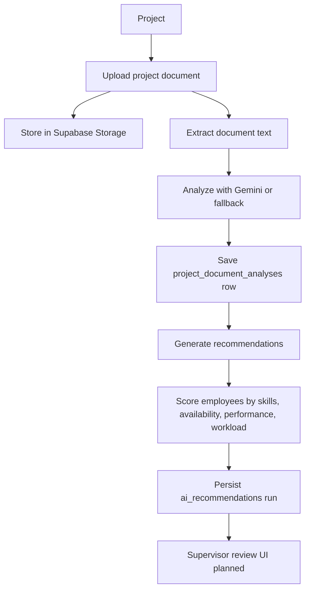
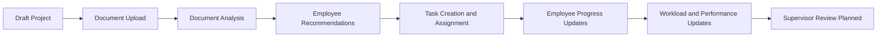

# Supervisor AI

[](https://nodejs.org/)
[](https://expressjs.com/)
[](https://react.dev/)
[](https://www.typescriptlang.org/)
[](https://vite.dev/)
[](https://tailwindcss.com/)
[](https://supabase.com/)

Supervisor AI is a full-stack workforce management platform for supervisors, administrators, and employees. The current implementation provides a TypeScript Express API backed by Supabase and a React frontend with a branded application shell, protected routing, and backend-integrated authentication.

The backend already includes core APIs for authentication, user roles, employee and supervisor profiles, projects, tasks, document uploads, document analysis, and employee recommendations. The frontend currently implements the application foundation, authentication screens, protected shell, and placeholder workspace pages. Product dashboards and data-connected frontend feature screens are planned.

## Project Objectives

- Help supervisors create projects, manage employees, assign tasks, and track work.
- Analyze uploaded project documents to identify skills, effort, risk, and staffing signals.
- Rank employees for projects using skills, availability, workload, and performance.
- Preserve human review: AI recommendations are advisory and do not auto-assign employees.
- Keep frontend, backend, database, storage, and AI responsibilities clearly separated.

## High-Level Architecture



## Technology Stack

| Layer | Current Technology |
| --- | --- |
| Frontend | React 19, React Router 7, Vite 8 |
| Frontend language | TypeScript 6, strict mode |
| Frontend styling | Tailwind CSS 4 with CSS design tokens |
| HTTP client | Axios |
| Backend | Node.js, Express 5 |
| Backend language | TypeScript 6, strict mode, ES modules |
| Database | Supabase PostgreSQL |
| Authentication | Supabase Auth JWTs |
| Storage | Supabase Storage bucket for project documents |
| Upload handling | Multer in memory storage |
| AI analysis | Google Gemini API with local fallback analysis |

## Repository Structure

```txt
supervisor-ai/
  backend/       Express API, Supabase integration, services, routes, middleware.
  frontend/      React application, auth UI, app shell, design system.
  supabase/      SQL migrations and seed files.
  CODEX.md       Project-level engineering and architecture guide.
```

## Backend Overview

The backend is an Express 5 REST API using a route, controller, service, middleware, and utility structure.

Implemented backend capabilities:

- Public signup and login through Supabase Auth.
- JWT authentication middleware.
- Role middleware for `admin`, `supervisor`, and `employee`.
- Admin user role management and skill approval workflows.
- Employee and supervisor profile APIs.
- Project creation, listing, detail, and update APIs.
- Task creation, assignment, listing, and employee progress updates.
- Workload and performance recalculation after assignment/progress changes.
- Project document upload to Supabase Storage.
- TXT extraction implemented; PDF and DOCX extraction currently return `pending`.
- Gemini-backed document analysis with safe local fallback when Gemini is unavailable.
- Recommendation generation persisted to `ai_recommendations`.

See [backend/README.md](backend/README.md) for the API reference and backend architecture.

## Frontend Overview

The frontend is a Vite React application with feature-based organization.

Implemented frontend capabilities:

- Locked brand color tokens and Supervisor logo component.
- Login and signup screens connected to the backend auth API.
- Auth provider with session restore, logout, and 401 handling.
- Protected route wrapper and role guard placeholder.
- Responsive app shell with sidebar and header.
- Placeholder route containers for dashboard, projects, tasks, employees, AI recommendations, and profile.

The frontend does not yet implement data-connected project, task, employee, dashboard, or recommendation screens.

See [frontend/README.md](frontend/README.md) for frontend architecture and setup.

## Authentication Overview

Authentication uses Supabase Auth on the backend. The frontend stores the access and refresh tokens for development, attaches the access token through the shared Axios client, and restores the user with `/api/v1/auth/me` on refresh.



## AI Recommendation Workflow

The current recommendation workflow is backend implemented and frontend planned.



## Project Lifecycle



## Database Overview

Migrations under `supabase/migrations` define core application tables and document/recommendation tables.

| Area | Tables or Storage |
| --- | --- |
| Identity | `users` mapped to Supabase Auth users |
| Profiles | `employees`, `supervisors` |
| Work management | `projects`, `tasks`, `task_progress` |
| Documents | `project_documents`, `project_document_analyses` |
| Recommendations | `ai_recommendations` |
| Storage | private `project-documents` bucket |
| Skills | Services use `skills` and `employee_skills`; the current migrations include an `employee_skills` uniqueness migration but do not fully define both tables in the visible migration set. |

## Local Development Setup

Prerequisites:

- Node.js 20 or newer.
- npm.
- A Supabase project with the required schema and storage bucket.
- A Gemini API key if Gemini analysis should run instead of local fallback analysis.

Install backend dependencies:

```bash
cd backend
npm install
```

Install frontend dependencies:

```bash
cd frontend
npm install
```

## Running the Backend

```bash
cd backend
npm run dev
```

The backend defaults to port `5000` when `PORT` is not set. The current frontend Vite proxy targets `http://localhost:4000`, so align `PORT` or update the frontend proxy/environment configuration for local development.

## Running the Frontend

```bash
cd frontend
npm run dev
```

The frontend uses `VITE_API_BASE_URL` when provided and falls back to `/api/v1`.

## Environment Variables

Only variable names are documented here. Do not commit real values.

| Scope | Variables |
| --- | --- |
| Backend | `PORT`, `SUPABASE_URL`, `SUPABASE_SERVICE_ROLE_KEY`, `GEMINI_API_KEY`, `GEMINI_MODEL` |
| Frontend | `VITE_API_BASE_URL` |

## Current Implementation Status

| Area | Status |
| --- | --- |
| Backend authentication | Implemented |
| Backend role authorization | Implemented |
| Backend employee and supervisor profiles | Implemented |
| Backend project and task APIs | Implemented |
| Backend document upload | Implemented |
| TXT document extraction | Implemented |
| PDF and DOCX extraction | Planned |
| Gemini document analysis | Implemented with fallback |
| Recommendation scoring and persistence | Implemented |
| Frontend auth screens and app shell | Implemented |
| Frontend data-connected dashboards and work management screens | Planned |
| Automated tests | Planned |

## Roadmap

| Status | Milestone |
| --- | --- |
| Done | Backend REST foundation with Supabase Auth and PostgreSQL access. |
| Done | Backend profile, project, task, document, and recommendation services. |
| Done | Frontend foundation, brand system, app shell, and authentication flow. |
| Planned | Frontend project, task, employee, and recommendation screens connected to backend APIs. |
| Planned | Supervisor dashboard and analytics views. |
| Planned | Employee workspace and progress workflows. |
| Planned | PDF and DOCX text extraction. |
| Planned | Recommendation review, accept, reject, and override workflow. |
| Planned | Notifications and richer analytics APIs. |
| Planned | Automated backend and frontend tests. |
| Planned | Production deployment hardening. |

## Future Milestones

Near-term work should connect the existing frontend placeholders to the implemented backend APIs, complete PDF/DOCX extraction, and add supervisor review workflows for generated recommendations. Longer-term work should add analytics, notifications, tests, observability, and production deployment configuration.

## Contributing

Before changing code, read `CODEX.md` and the relevant `backend/CODEX.md` or `frontend/CODEX.md`.

Expected workflow:

1. Keep backend, frontend, and database responsibilities separate.
2. Keep backend business logic in services.
3. Keep frontend pages as route containers.
4. Route frontend API calls through services.
5. Document only implemented behavior.
6. Run the relevant build and lint commands before opening a change.

## License

No repository-level `LICENSE` file is currently present. The backend package metadata declares `ISC`; confirm the intended project license before publishing.
