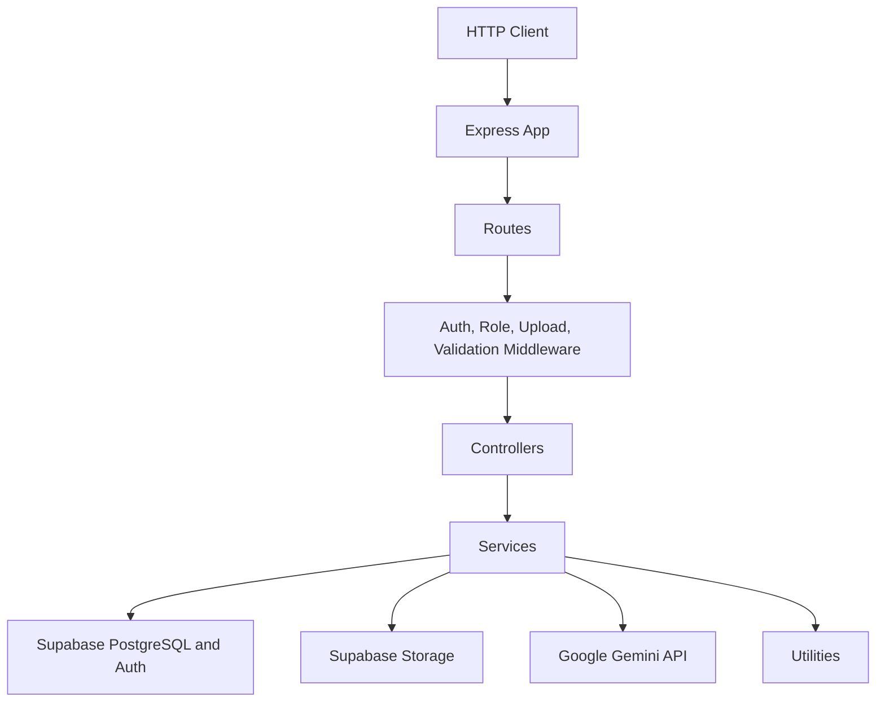
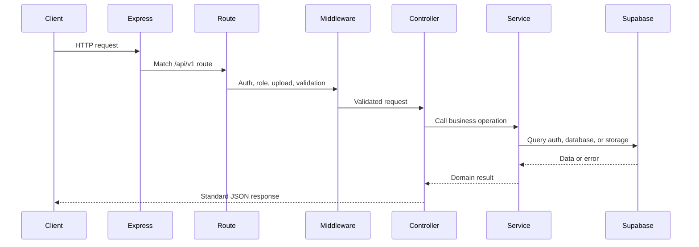
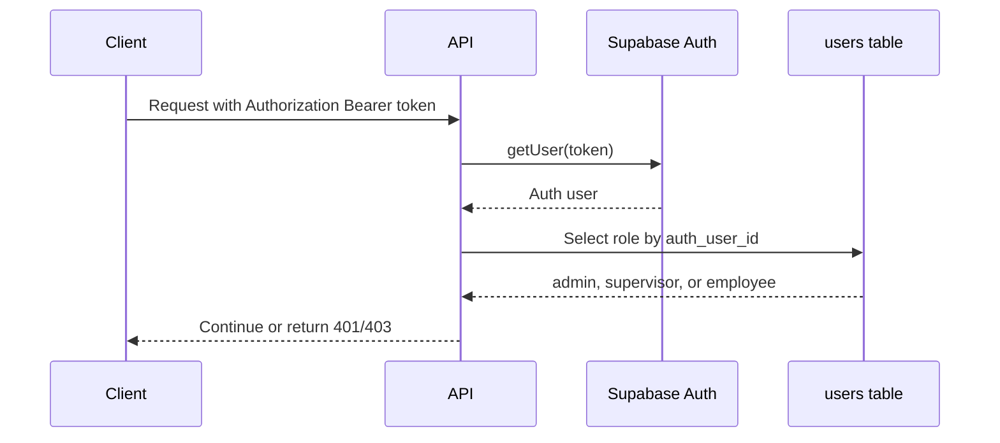
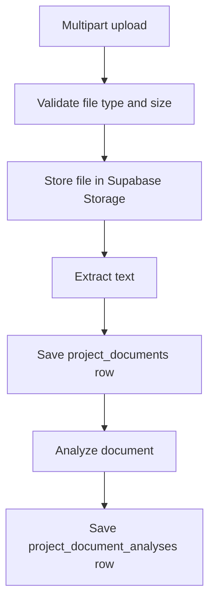
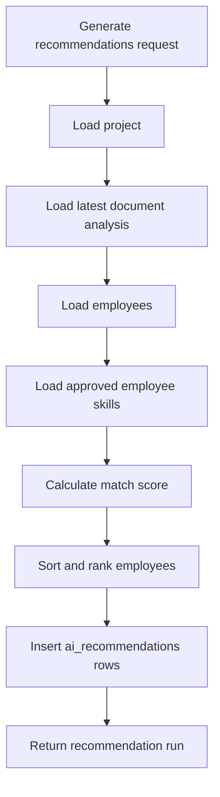

# Supervisor AI Backend

[](https://nodejs.org/)
[](https://expressjs.com/)
[](https://www.typescriptlang.org/)
[](https://supabase.com/)
[](https://github.com/expressjs/multer)

The Supervisor AI backend is a TypeScript Express API for authentication, role authorization, profiles, projects, tasks, document ingestion, document analysis, and employee recommendation generation.

## Architecture

The backend follows a layered Express architecture:



Architectural decisions:

- Routes define URL structure and attach middleware.
- Controllers translate HTTP input/output and delegate business rules.
- Services own Supabase queries, AI calls, scoring, and workload calculations.
- Middleware owns authentication, role checks, upload parsing, and error handling.
- Utilities own response formatting, validation helpers, and application errors.

## Folder Structure

```txt
backend/
  src/
    config/        Supabase client setup.
    controllers/   HTTP handlers for each route group.
    middleware/    Authentication, roles, upload handling, validation, errors.
    routes/        Express route definitions.
    services/      Business logic, database access, AI integration.
    types/         Shared TypeScript contracts.
    utils/         Response, validation, and error helpers.
    server.ts      Express app bootstrap.
  package.json
  tsconfig.json
```

## Express Request Lifecycle



## Route Architecture

```mermaid
flowchart LR
  Server[server.ts] --> Auth[/api/v1/auth]
  Server --> Admin[/api/v1/admin]
  Server --> Health[/api/v1/health]
  Server --> Employees[/api/v1/employees]
  Server --> Supervisors[/api/v1/supervisors]
  Server --> Projects[/api/v1/projects]
  Server --> Tasks[/api/v1/tasks]
  Projects --> Documents[Project Documents]
  Projects --> Recommendations[Project Recommendations]
```

## Routes, Controllers, Services, and Middleware

| Layer | Implemented Files | Responsibility |
| --- | --- | --- |
| Routes | `authRoutes`, `adminRoutes`, `employeeRoutes`, `supervisorRoutes`, `projectRoutes`, `taskRoutes`, `healthRoutes` | Define route groups, path parameters, and middleware order. |
| Controllers | Auth, admin, employee, supervisor, project, document, recommendation, and task controllers | Validate request ownership assumptions, call services, and return standard JSON responses. |
| Services | Auth, user, admin, skill, employee, supervisor, project, task, document, AI, and recommendation services | Own business rules, Supabase access, document analysis, scoring, workload, and performance calculations. |
| Middleware | Auth, role, upload, validation, and error middleware | Verify tokens, enforce roles, handle multipart uploads, validate auth bodies, and normalize errors. |

## API Response Contract

Success responses use:

```json
{
  "success": true,
  "message": "Operation completed.",
  "data": {}
}
```

Error responses use:

```json
{
  "success": false,
  "message": "Human-readable error.",
  "error": "Human-readable error."
}
```

## Authentication and Authorization

Authentication uses Supabase Auth JWTs. `authenticateUser` reads the Bearer token, verifies it with Supabase, and attaches the Supabase user to `req.user`.

Role authorization uses the application `users` table. `requireRole()` loads the user's application role by `auth_user_id` and rejects users outside the allowed roles.



Implemented roles:

- `admin`
- `supervisor`
- `employee`

Public signup always creates an `employee` application user. Admin APIs can change roles.

## Supabase Integration

`src/config/supabase.ts` creates Supabase clients from environment variables and disables client-side session persistence on the backend.

The backend uses Supabase for:

- Auth user creation and password login.
- JWT verification.
- PostgreSQL application data.
- Private project document storage.

## Database Schema Overview

Implemented migrations define:

| Table or Resource | Purpose |
| --- | --- |
| `users` | Application user profile mapped to Supabase Auth. |
| `employees` | Employee profile, capacity, workload, availability, and performance. |
| `supervisors` | Supervisor profile and department metadata. |
| `projects` | Supervisor/admin-created work containers. |
| `tasks` | Project work items with assignment and status. |
| `task_progress` | Employee progress updates. |
| `project_documents` | Uploaded document metadata and extracted text status. |
| `project_document_analyses` | AI or fallback analysis output for project documents. |
| `ai_recommendations` | Persisted ranked employee recommendation runs. |
| `project-documents` storage bucket | Private Supabase Storage bucket for uploaded project documents. |

The service layer also uses `skills` and `employee_skills` for employee skill matching. The visible migration set includes a uniqueness migration for `employee_skills`, but does not fully define both skill tables; ensure the target Supabase database has those tables before using profile skills or recommendations.

As of the skills schema repair migration, the checked-in migration set explicitly recreates the live `skills` and `employee_skills` tables, including:

- `skills.normalized_name` uniqueness
- `employee_skills (employee_id, skill_id)` uniqueness
- `employee_skills` proficiency and non-negative experience checks
- `skills.created_by -> users(id) on delete set null`
- backend-only access posture with RLS enabled and no new direct client policies

The repair migration is intentionally ordered before the older `employee_skills` uniqueness migration so clean environments can replay the historical migration chain without editing already-applied files.

## API Reference

All API routes are mounted under `/api/v1`.

### Root and Health

| Method | Path | Access | Description |
| --- | --- | --- | --- |
| `GET` | `/` | Public | Backend status message. |
| `GET` | `/api/v1/health/supabase` | Public | Checks database connectivity by querying `users`. |

### Auth

| Method | Path | Access | Description |
| --- | --- | --- | --- |
| `POST` | `/api/v1/auth/signup` | Public | Creates a Supabase Auth user, creates an app user with `employee` role, and returns a session. |
| `POST` | `/api/v1/auth/login` | Public | Signs in with email and password and returns a session. |
| `GET` | `/api/v1/auth/me` | Authenticated | Returns the current application user. |

### Admin

| Method | Path | Access | Description |
| --- | --- | --- | --- |
| `GET` | `/api/v1/admin/skills/pending` | Admin, supervisor | Lists unapproved skills. |
| `PATCH` | `/api/v1/admin/skills/:skillId/approve` | Admin, supervisor | Approves a pending skill. |
| `DELETE` | `/api/v1/admin/skills/:skillId` | Admin, supervisor | Deletes a rejected skill and related employee links. |
| `GET` | `/api/v1/admin/dashboard` | Admin | Returns a basic admin welcome response. |
| `GET` | `/api/v1/admin/users` | Admin | Lists application users. |
| `PATCH` | `/api/v1/admin/users/:userId/role` | Admin | Updates an application user's role. |

### Employees

| Method | Path | Access | Description |
| --- | --- | --- | --- |
| `GET` | `/api/v1/employees/skills` | Authenticated | Lists approved skills. |
| `GET` | `/api/v1/employees/me` | Authenticated employee | Returns the current employee profile. |
| `POST` | `/api/v1/employees/profile` | Authenticated employee | Creates the current employee profile. |
| `PATCH` | `/api/v1/employees/me` | Authenticated employee | Updates the current employee profile and skills. |

### Supervisors

| Method | Path | Access | Description |
| --- | --- | --- | --- |
| `GET` | `/api/v1/supervisors/me` | Authenticated | Returns the current supervisor profile. |
| `POST` | `/api/v1/supervisors/profile` | Authenticated supervisor | Creates the current supervisor profile. |
| `PATCH` | `/api/v1/supervisors/employees/:employeeId/work-settings` | Admin, supervisor | Updates employee employment type or weekly capacity. |

### Projects

| Method | Path | Access | Description |
| --- | --- | --- | --- |
| `GET` | `/api/v1/projects` | Admin, supervisor | Lists non-deleted projects. |
| `POST` | `/api/v1/projects` | Admin, supervisor | Creates a project. |
| `GET` | `/api/v1/projects/:projectId` | Admin, supervisor | Gets a project by ID. |
| `PATCH` | `/api/v1/projects/:projectId` | Admin, supervisor | Updates project fields. |
| `POST` | `/api/v1/projects/:projectId/documents` | Admin, supervisor | Uploads and analyzes a project document. |
| `POST` | `/api/v1/projects/:projectId/recommendations` | Admin, supervisor | Generates and persists employee recommendations. |
| `GET` | `/api/v1/projects/:projectId/recommendations` | Admin, supervisor | Returns the latest recommendation run for a project. |

### Tasks

| Method | Path | Access | Description |
| --- | --- | --- | --- |
| `GET` | `/api/v1/tasks` | Authenticated | Lists all tasks for admins/supervisors, or assigned tasks for employees. |
| `POST` | `/api/v1/tasks` | Admin, supervisor | Creates a task. |
| `PATCH` | `/api/v1/tasks/:taskId/assign` | Admin, supervisor | Assigns or unassigns a task. |
| `POST` | `/api/v1/tasks/:taskId/progress` | Employee | Creates a progress update for the assigned employee. |

## Validation

Validation is implemented with local helpers in `src/utils/validation.ts`.

Implemented validation includes:

- Required request body checks.
- Email and password checks for auth.
- UUID validation for route params and body IDs.
- Required and optional string fields.
- Optional string arrays.
- Optional numeric ranges.
- Optional enum values.
- Upload size and MIME checks for project documents.

## Error Handling

`AppError` carries an HTTP status and exposure flag. The global error handler:

- Returns safe `AppError` messages when exposed.
- Hides internal errors behind `Internal server error.`
- Returns a standard response shape.
- Includes a not-found handler for unmatched routes.

## File Upload Architecture

Project documents use Multer memory storage through `uploadProjectDocumentFile`.

Implemented constraints:

- Multipart field name: `file`.
- Maximum file size: 10 MB.
- Supported MIME types: PDF, DOCX, TXT.
- Storage bucket: `project-documents`.
- Files are uploaded to Supabase Storage under a project-scoped generated path.

## Document Extraction Pipeline



Extraction status:

| Type | Current Behavior |
| --- | --- |
| TXT | Extracts UTF-8 text. |
| PDF | Marks extraction as `pending`; PDF extraction is planned. |
| DOCX | Marks extraction as `pending`; DOCX extraction is planned. |

## AI Analysis Architecture

`aiService` analyzes extracted document text with Gemini when `GEMINI_API_KEY` is configured and text is available. Gemini responses are parsed and normalized into a constrained shape.

If Gemini is unavailable, fails, or there is no extracted text, the service returns a local fallback analysis with `provider: "placeholder"`.

## Recommendation Engine Architecture



Scoring signals:

| Signal | Weight |
| --- | --- |
| Skill match | 50% |
| Availability | 25% |
| Performance | 15% |
| Workload | 10% |

Recommendations include rank, match score, confidence score, matched skills, missing skills, score breakdown, and summary.

## Workload and Performance Calculation

Workload is recalculated from active task estimated hours divided by weekly capacity. Active statuses are `todo`, `in_progress`, `blocked`, and `review`.

Availability is `100 - workload_percentage`, clamped between 0 and 100.

Performance is recalculated from assigned tasks and latest progress records. Completed tasks score 100, review tasks score at least 85, blocked tasks score at most 60, cancelled tasks are ignored, and task scores are weighted by estimated hours.

## Environment Variables

Only variable names are documented. Do not commit real values.

| Variable | Required | Purpose |
| --- | --- | --- |
| `PORT` | No | HTTP server port; defaults to `5000`. |
| `SUPABASE_URL` | Yes | Supabase project URL. |
| `SUPABASE_SERVICE_ROLE_KEY` | Yes | Backend-only Supabase service role key. |
| `GEMINI_API_KEY` | No | Enables Gemini document analysis. |
| `GEMINI_MODEL` | No | Overrides the Gemini model; defaults in code when omitted. |

## Build and Development Commands

| Command | Description |
| --- | --- |
| `npm run dev` | Run the API with `tsx watch src/server.ts`. |
| `npm run build` | Compile TypeScript into `dist`. |
| `npm start` | Run `dist/server.js`. |

## Deployment Notes

- Build with `npm run build`.
- Run with `npm start`.
- Provide all required Supabase environment variables.
- Keep `SUPABASE_SERVICE_ROLE_KEY` backend-only.
- Ensure the Supabase schema, storage bucket, and skills repair migration are applied before enabling profile skills or recommendations.
- Configure CORS explicitly for production; the current implementation uses default `cors()` behavior.

## Backend Roadmap

| Status | Item |
| --- | --- |
| Done | Supabase Auth signup, login, and current-user endpoint. |
| Done | Role middleware and admin role management. |
| Done | Employee and supervisor profile APIs. |
| Done | Project and task APIs. |
| Done | Workload and performance recalculation. |
| Done | Project document upload and TXT extraction. |
| Done | Gemini or fallback document analysis. |
| Done | Recommendation generation and persistence. |
| Planned | PDF and DOCX extraction implementation. |
| Planned | Recommendation accept, reject, and override workflow. |
| Planned | Notification and analytics APIs. |
| Planned | Rate limiting for auth, uploads, and AI routes. |
| Planned | Automated tests. |
| Planned | Production CORS and observability hardening. |
