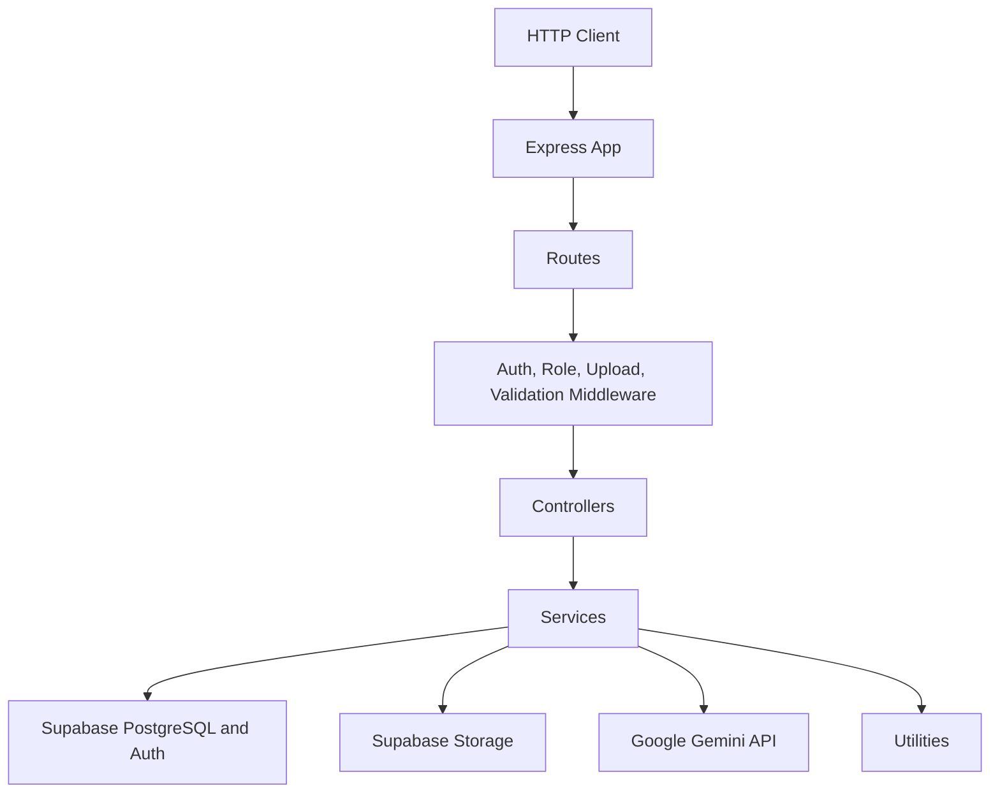
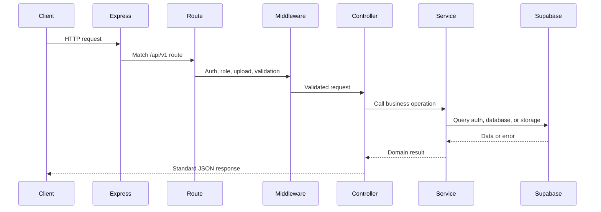
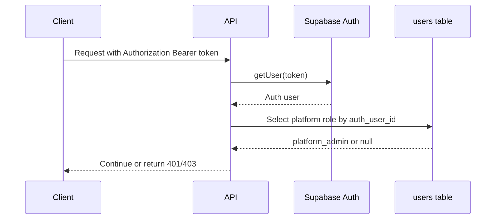
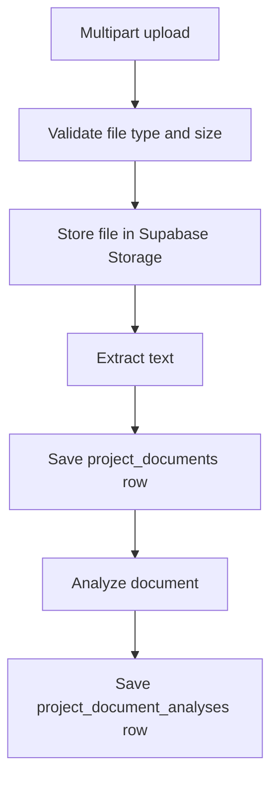
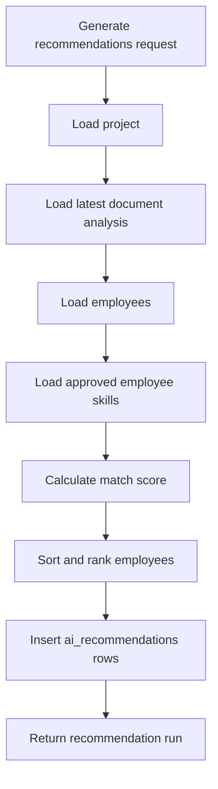

# Supervisor AI Backend

[](https://nodejs.org/)
[](https://expressjs.com/)
[](https://www.typescriptlang.org/)
[](https://supabase.com/)
[](https://github.com/expressjs/multer)

The Supervisor AI backend is a TypeScript Express API for authentication, role authorization, profiles, projects, tasks, document ingestion, document analysis, and employee recommendation generation.

## Architecture

The backend follows a layered Express architecture:



Architectural decisions:

- Routes define URL structure and attach middleware.
- Controllers translate HTTP input/output and delegate business rules.
- Services own Supabase queries, AI calls, scoring, and workload calculations.
- Middleware owns authentication, role checks, upload parsing, and error handling.
- Utilities own response formatting, validation helpers, and application errors.

## Folder Structure

```txt
backend/
  src/
    config/        Supabase client setup.
    controllers/   HTTP handlers for each route group.
    middleware/    Authentication, roles, upload handling, validation, errors.
    routes/        Express route definitions.
    services/      Business logic, database access, AI integration.
    types/         Shared TypeScript contracts.
    utils/         Response, validation, and error helpers.
    server.ts      Express app bootstrap.
  package.json
  tsconfig.json
```

## Express Request Lifecycle



## Route Architecture

```mermaid
flowchart LR
  Server[server.ts] --> Auth[/api/v1/auth]
  Server --> Admin[/api/v1/admin]
  Server --> Health[/api/v1/health]
  Server --> Employees[/api/v1/employees]
  Server --> Supervisors[/api/v1/supervisors]
  Server --> Projects[/api/v1/projects]
  Server --> Tasks[/api/v1/tasks]
  Projects --> Documents[Project Documents]
  Projects --> Recommendations[Project Recommendations]
```

## Routes, Controllers, Services, and Middleware

| Layer | Implemented Files | Responsibility |
| --- | --- | --- |
| Routes | `authRoutes`, `adminRoutes`, `employeeRoutes`, `supervisorRoutes`, `projectRoutes`, `taskRoutes`, `healthRoutes` | Define route groups, path parameters, and middleware order. |
| Controllers | Auth, admin, employee, supervisor, project, document, recommendation, and task controllers | Validate request ownership assumptions, call services, and return standard JSON responses. |
| Services | Auth, user, admin, skill, employee, supervisor, project, task, document, AI, and recommendation services | Own business rules, Supabase access, document analysis, scoring, workload, and performance calculations. |
| Middleware | Auth, role, upload, validation, and error middleware | Verify tokens, enforce roles, handle multipart uploads, validate auth bodies, and normalize errors. |

## API Response Contract

Success responses use:

```json
{
  "success": true,
  "message": "Operation completed.",
  "data": {}
}
```

Error responses use:

```json
{
  "success": false,
  "message": "Human-readable error.",
  "error": "Human-readable error."
}
```

## Authentication and Authorization

Authentication uses Supabase Auth JWTs. `authenticateUser` reads the Bearer token, verifies it with Supabase, and attaches the Supabase user to `req.user`.

Authorization is split between platform-level and organization-level checks:

- `requirePlatformRole()` uses `users.platform_role` for platform administration
- `requireRole()` remains as a deprecated compatibility alias and must not be used for new authorization work
- `resolveOrganizationContext` plus `requireOrganizationRole()` enforce tenant-scoped access from `organization_members`



Platform role values:

- `platform_admin`

Organization membership role values:

- `organization_admin`
- `supervisor`
- `employee`

Legacy compatibility notes:

- `users.role` remains temporarily for backward compatibility and migration safety
- legacy values may still be `admin`, `supervisor`, or `employee`
- only legacy `admin` values are backfilled into `users.platform_role = 'platform_admin'`
- legacy `employee` and `supervisor` values must not be treated as platform authorization

Current onboarding model:

- `POST /api/v1/auth/register` creates account identity only
- `POST /api/v1/organizations` bootstraps the caller's first organization and active `organization_admin` membership
- employees and supervisors join only through organization invitations
- `POST /api/v1/auth/signup` is deprecated legacy employee provisioning and should remain disabled unless temporary compatibility is required

Onboarding state:

- auth session responses and `GET /api/v1/auth/me` include `onboarding`
- `onboarding.hasActiveOrganization` reflects active memberships
- `onboarding.hasPendingInvitations` reflects invited memberships
- `onboarding.requiresOrganizationCreation` is true only when the user has neither an active organization nor a pending invitation

Compatibility flag:

- `AUTH_LEGACY_EMPLOYEE_SIGNUP_ENABLED=true` temporarily re-enables legacy public employee signup
- when omitted or set to any other value, `/api/v1/auth/signup` returns `410 Gone`
- if a target database still enforces `users.role not null`, identity-only registration temporarily persists the legacy compatibility value `admin` with `platform_role = null`; auth responses still expose `legacyRole` and `role` as `null` for that case

Tenant-scoped business routes must use verified organization membership rather than `users.role`.

## Supabase Integration

`src/config/supabase.ts` creates Supabase clients from environment variables and disables client-side session persistence on the backend.

The backend uses Supabase for:

- Auth user creation and password login.
- JWT verification.
- PostgreSQL application data.
- Private project document storage.

## Database Schema Overview

Implemented migrations define:

| Table or Resource | Purpose |
| --- | --- |
| `users` | Application user profile mapped to Supabase Auth. |
| `employees` | Employee profile, capacity, workload, availability, and performance. |
| `supervisors` | Supervisor profile and department metadata. |
| `projects` | Supervisor/admin-created work containers. |
| `tasks` | Project work items with assignment and status. |
| `task_progress` | Employee progress updates. |
| `project_documents` | Uploaded document metadata and extracted text status. |
| `project_document_analyses` | AI or fallback analysis output for project documents. |
| `ai_recommendations` | Persisted ranked employee recommendation runs. |
| `project-documents` storage bucket | Private Supabase Storage bucket for uploaded project documents. |

The service layer also uses `skills` and `employee_skills` for employee skill matching. The visible migration set includes a uniqueness migration for `employee_skills`, but does not fully define both skill tables; ensure the target Supabase database has those tables before using profile skills or recommendations.

As of the skills schema repair migration, the checked-in migration set explicitly recreates the live `skills` and `employee_skills` tables, including:

- `skills.normalized_name` uniqueness
- `employee_skills (employee_id, skill_id)` uniqueness
- `employee_skills` proficiency and non-negative experience checks
- `skills.created_by -> users(id) on delete set null`
- backend-only access posture with RLS enabled and no new direct client policies

The repair migration is intentionally ordered before the older `employee_skills` uniqueness migration so clean environments can replay the historical migration chain without editing already-applied files.

## Schema Reconciliation

Source of truth:

- applied SQL migrations under `supabase/migrations/`
- the live Supabase schema after all forward migrations
- backend services and request/response contracts that depend on those tables

Rules for future schema changes:

- never edit or reorder an already-applied migration in place
- add a new forward-only migration for every schema change
- prefer guarded `if not exists` / catalog-checked changes when repairing drift
- verify that service code still matches column names, nullability, and value shapes

Replay expectations:

- the repository migration chain should create all tables before any later migration alters them
- the skills repair migration `202606180001_repair_skills_schema_drift.sql` exists specifically so clean replay creates `skills` and `employee_skills` before the older uniqueness migration runs
- the follow-up reconciliation migration `202607160001_reconcile_live_schema.sql` applies only low-risk adjustments needed for better live alignment

Known intentional differences from live:

- base-table drift outside the skills tables is documented but not normalized automatically when doing so would change current production behavior
- examples include `users.role`, `users.platform_role`, and `employees.employment_type` being `text` in live while older repository migrations model them more strictly
- nullable and timestamp-shape differences on legacy tables are also documented drift unless the application requires a safe forward migration

Warning:

- do not edit an applied migration to "fix history"
- add a new migration and document the reason instead

## Multi-Tenant Security Model

Source of truth for organization tenancy:

- `organizations`
- `organization_members`
- `organization_invitations`
- forward-only migrations under `supabase/migrations/`

Current behavior:

- organization membership role is the source of truth for organization-scoped authorization
- `users.platform_role` is the source of truth for platform-only authorization
- `users.role` remains as a temporary deprecated compatibility field
- the selected organization is supplied by `X-Organization-Id`
- the header only selects context; it never grants membership on its own
- invited and suspended memberships are returned by `GET /api/v1/organizations` for state rendering but cannot access tenant data
- invitation acceptance provisions employee or supervisor profiles for the selected organization
- employee directory, profiles, projects, tasks, documents, recommendations, and dashboards are scoped by verified organization context

Invitation lifecycle:

1. An active `organization_admin` creates an invitation in a verified organization context.
2. The backend generates a high-entropy raw token, stores only its hash, persists invitation metadata, and creates or reuses the invited app user plus `invited` membership.
3. The backend builds a frontend acceptance URL and sends the invitation through the current Supabase invite or generate-link flow.
4. `GET /api/v1/organizations` exposes invited memberships for state rendering.
5. `GET /api/v1/invitations/:token` returns safe invitation-inspection metadata without requiring `X-Organization-Id`.
6. `POST /api/v1/invitations/:token/accept` verifies token, identity, expiry, status, and membership ownership, then activates the membership and provisions the organization-scoped profile.
7. `POST /api/v1/organizations/:organizationId/invitations/:invitationId/resend` rotates the token, refreshes expiry, and invalidates the previous acceptance URL.
8. `POST /api/v1/organizations/:organizationId/invitations/:invitationId/revoke` marks the invitation revoked and keeps the pending membership suspended as revoked metadata.

Invitation compatibility and deprecation notes:

- the legacy organization-context acceptance route `POST /api/v1/organizations/invitations/accept` remains temporarily for frontend compatibility and is deprecated
- the secure token-based lifecycle is the canonical flow for new frontend work
- the repository now includes a forward migration for dedicated invitation-token columns
- until that migration is applied in every environment, the runtime also persists invitation token metadata in a reserved `profile.__invitation_meta` envelope so the secure flow keeps working safely on pre-migration databases
- once the migration is applied everywhere, this compatibility layer can be removed in a later cleanup phase

Current tenant isolation guarantees:

- organization details, members, and invitations are organization scoped
- employee directory and employee work-setting changes are organization scoped
- employee and supervisor self-profile routes are organization scoped
- projects are filtered by verified organization membership
- tasks and task progress are filtered through `project -> task` ownership plus org-specific employee assignment checks
- project documents and analyses are filtered through verified parent projects
- recommendation generation and retrieval only consider employees in the selected organization
- supervisor and employee dashboards summarize only the selected organization
- child tables without direct `organization_id` have RLS enabled and direct `anon` / `authenticated` table access revoked

Known limitations:

- `users.role` still exists for legacy compatibility and must not be reused for tenant authorization
- service-role backend flows still require explicit organization filters; frontend filtering is not security
- PDF and DOCX extraction remain limited
- clean replay with Supabase CLI has not been executed in this repository environment because the CLI is unavailable here

Rules for future multi-tenant work:

- do not edit already-applied migrations
- add new forward-only migrations for every tenant change
- always scope migrated service queries by verified `organization_id`
- use membership role middleware for tenant authorization instead of `users.role`
- keep platform administration and organization administration separate

## Platform and Tenant Role Model

The backend uses two separate authorization layers:

- platform identity: `users.platform_role`
- tenant membership: `organization_members.role`

Responsibilities:

- `platform_admin` is for SaaS-platform administration only
- `organization_admin`, `supervisor`, and `employee` are tenant roles only
- a platform admin does not bypass tenant membership checks automatically
- a single user may hold `platform_admin` plus one or more tenant memberships independently

Middleware responsibilities:

- `authenticateUser` verifies the JWT and populates `req.user`
- `requirePlatformRole("platform_admin")` enforces platform-only routes
- `resolveOrganizationContext` validates the selected `X-Organization-Id` against membership
- `requireOrganizationRole(...)` enforces tenant role requirements after organization resolution

Migration strategy:

- new code must read platform authorization from `users.platform_role`
- new tenant code must read authorization from `organization_members.role`
- `users.role` remains deprecated compatibility data until remaining contracts no longer depend on it
- never store tenant membership roles in `platform_role`
- public account registration must not assign employee or supervisor meaning to `users.role`

## API Reference

All API routes are mounted under `/api/v1`.

### Root and Health

| Method | Path | Access | Description |
| --- | --- | --- | --- |
| `GET` | `/` | Public | Backend status message. |
| `GET` | `/api/v1/health/supabase` | Public | Checks database connectivity by querying `users`. |

### Auth

| Method | Path | Access | Description |
| --- | --- | --- | --- |
| `POST` | `/api/v1/auth/register` | Public | Creates account identity only, signs in, and returns onboarding state requiring organization creation when no membership exists. |
| `POST` | `/api/v1/auth/signup` | Public | Deprecated legacy employee provisioning endpoint. Returns `410 Gone` unless `AUTH_LEGACY_EMPLOYEE_SIGNUP_ENABLED=true`. |
| `POST` | `/api/v1/auth/login` | Public | Signs in with email and password and returns a session including `user.platformRole`. |
| `GET` | `/api/v1/auth/me` | Authenticated | Returns the current application user including `platformRole`, deprecated legacy-role compatibility fields, and onboarding state. |

### Invitations

| Method | Path | Access | Description |
| --- | --- | --- | --- |
| `GET` | `/api/v1/invitations/:token` | Public or authenticated | Returns safe invitation-inspection metadata for the supplied token. |
| `POST` | `/api/v1/invitations/:token/accept` | Authenticated | Accepts the invitation token for the authenticated email and provisions the tenant profile. |

### Admin

| Method | Path | Access | Description |
| --- | --- | --- | --- |
| `GET` | `/api/v1/admin/skills/pending` | Platform admin | Lists unapproved skills. |
| `PATCH` | `/api/v1/admin/skills/:skillId/approve` | Platform admin | Approves a pending skill. |
| `DELETE` | `/api/v1/admin/skills/:skillId` | Platform admin | Deletes a rejected skill and related employee links. |
| `GET` | `/api/v1/admin/dashboard` | Platform admin | Returns a basic platform-admin response. |
| `GET` | `/api/v1/admin/users` | Platform admin | Lists application users. |
| `PATCH` | `/api/v1/admin/users/:userId/role` | Platform admin | Updates the legacy compatibility role and synchronized platform-role mapping. |

### Employees

| Method | Path | Access | Description |
| --- | --- | --- | --- |
| `GET` | `/api/v1/employees/skills` | Authenticated | Lists approved skills. |
| `GET` | `/api/v1/employees/me` | Authenticated employee | Returns the current employee profile. |
| `POST` | `/api/v1/employees/profile` | Authenticated employee | Creates the current employee profile. |
| `PATCH` | `/api/v1/employees/me` | Authenticated employee | Updates the current employee profile and skills. |

### Supervisors

| Method | Path | Access | Description |
| --- | --- | --- | --- |
| `GET` | `/api/v1/supervisors/me` | Authenticated | Returns the current supervisor profile. |
| `POST` | `/api/v1/supervisors/profile` | Authenticated supervisor | Creates the current supervisor profile. |
| `PATCH` | `/api/v1/supervisors/employees/:employeeId/work-settings` | Admin, supervisor | Updates employee employment type or weekly capacity. |

### Projects

| Method | Path | Access | Description |
| --- | --- | --- | --- |
| `GET` | `/api/v1/projects` | Admin, supervisor | Lists non-deleted projects. |
| `POST` | `/api/v1/projects` | Admin, supervisor | Creates a project. |
| `GET` | `/api/v1/projects/:projectId` | Admin, supervisor | Gets a project by ID. |
| `PATCH` | `/api/v1/projects/:projectId` | Admin, supervisor | Updates project fields. |
| `POST` | `/api/v1/projects/:projectId/documents` | Admin, supervisor | Uploads and analyzes a project document. |
| `POST` | `/api/v1/projects/:projectId/recommendations` | Admin, supervisor | Generates and persists employee recommendations. |
| `GET` | `/api/v1/projects/:projectId/recommendations` | Admin, supervisor | Returns the latest recommendation run for a project. |

### Organizations

| Method | Path | Access | Description |
| --- | --- | --- | --- |
| `GET` | `/api/v1/organizations` | Authenticated | Lists the current user's active, invited, and suspended organization memberships. |
| `POST` | `/api/v1/organizations` | Authenticated | Creates the caller's first organization and active `organization_admin` membership. |
| `GET` | `/api/v1/organizations/:organizationId` | Organization member | Returns organization details in verified context. |
| `GET` | `/api/v1/organizations/:organizationId/members` | Organization admin, supervisor | Lists organization members. |
| `GET` | `/api/v1/organizations/:organizationId/invitations` | Organization admin | Lists organization invitations. |
| `POST` | `/api/v1/organizations/:organizationId/invitations` | Organization admin | Creates an employee or supervisor invitation. |
| `POST` | `/api/v1/organizations/:organizationId/invitations/:invitationId/resend` | Organization admin | Rotates the invitation token, extends expiry, and resends the acceptance link. |
| `POST` | `/api/v1/organizations/:organizationId/invitations/:invitationId/revoke` | Organization admin | Revokes an open invitation and suspends the pending membership metadata. |
| `POST` | `/api/v1/organizations/invitations/accept` | Authenticated | Deprecated legacy organization-context acceptance route. |

### Tasks

| Method | Path | Access | Description |
| --- | --- | --- | --- |
| `GET` | `/api/v1/tasks` | Authenticated | Lists all tasks for admins/supervisors, or assigned tasks for employees. |
| `POST` | `/api/v1/tasks` | Admin, supervisor | Creates a task. |
| `PATCH` | `/api/v1/tasks/:taskId/assign` | Admin, supervisor | Assigns or unassigns a task. |
| `POST` | `/api/v1/tasks/:taskId/progress` | Employee | Creates a progress update for the assigned employee. |

## Validation

Validation is implemented with local helpers in `src/utils/validation.ts`.

Implemented validation includes:

- Required request body checks.
- Email and password checks for auth.
- UUID validation for route params and body IDs.
- Required and optional string fields.
- Optional string arrays.
- Optional numeric ranges.
- Optional enum values.
- Upload size and MIME checks for project documents.

## Error Handling

`AppError` carries an HTTP status and exposure flag. The global error handler:

- Returns safe `AppError` messages when exposed.
- Hides internal errors behind `Internal server error.`
- Returns a standard response shape.
- Includes a not-found handler for unmatched routes.

## File Upload Architecture

Project documents use Multer memory storage through `uploadProjectDocumentFile`.

Implemented constraints:

- Multipart field name: `file`.
- Maximum file size: 10 MB.
- Supported MIME types: PDF, DOCX, TXT.
- Storage bucket: `project-documents`.
- Files are uploaded to Supabase Storage under a project-scoped generated path.

## Document Extraction Pipeline



Extraction status:

| Type | Current Behavior |
| --- | --- |
| TXT | Extracts UTF-8 text. |
| PDF | Extracts text and page count with `pdf-parse`. |
| DOCX | Extracts raw text with `mammoth`. |

## AI Analysis Architecture

`aiService` delegates to the Gemini SDK when `GEMINI_API_KEY` is configured. Responses must match the constrained JSON shape and are retried once if Gemini returns an invalid result. Failed extraction or analysis returns a structured API error and cleans up incomplete uploads; there is no placeholder analysis.

## Recommendation Engine Architecture



Scoring signals:

| Signal | Weight |
| --- | --- |
| Required skill match | 50% |
| Preferred skill match | 15% |
| Availability | 15% |
| Performance | 10% |
| Matching-skill proficiency | 5% |
| Matching-skill experience | 5% |

Recommendations include rank, match score, confidence score, matched skills, missing skills, score breakdown, and summary. They also separate required and preferred skill matches, include workload, availability, performance, weekly capacity, estimated project hours, suitability, and human-readable reasons. Recommendations are advisory only; generating a run never assigns an employee to a task.

## Workload and Performance Calculation

Workload is recalculated from active task estimated hours divided by weekly capacity. Active statuses are `todo`, `in_progress`, `blocked`, and `review`.

Availability is `100 - workload_percentage`, clamped between 0 and 100.

Performance is recalculated from assigned tasks and latest progress records. Completed tasks score 100, review tasks score at least 85, blocked tasks score at most 60, cancelled tasks are ignored, and task scores are weighted by estimated hours.

## Environment Variables

Only variable names are documented. Do not commit real values.

| Variable | Required | Purpose |
| --- | --- | --- |
| `PORT` | No | HTTP server port; defaults to `5000`. |
| `SUPABASE_URL` | Yes | Supabase project URL. |
| `SUPABASE_SERVICE_ROLE_KEY` | Yes | Backend-only Supabase service role key. |
| `AUTH_LEGACY_EMPLOYEE_SIGNUP_ENABLED` | No | Set to `true` only for temporary compatibility with the deprecated public employee signup flow. |
| `FRONTEND_APP_URL` | Yes in production | Base frontend URL used to build invitation acceptance links. |
| `INVITATION_DEBUG_RETURN_URL` | No | Development-only flag that returns the acceptance URL in create or resend responses for local verification. |
| `GEMINI_API_KEY` | Yes for document analysis | Gemini API key; never expose it to clients. |
| `GEMINI_MODEL` | No | Overrides the Gemini model; defaults in code when omitted. |

## Build and Development Commands

| Command | Description |
| --- | --- |
| `npm run dev` | Run the API with `tsx watch src/server.ts`. |
| `npm run build` | Compile TypeScript into `dist`. |
| `npm start` | Run `dist/server.js`. |
| `npm run verify:onboarding` | Exercise public registration, organization bootstrap, invitation-only activation, and legacy-signup deprecation checks. |
| `npm run verify:invitations` | Exercise secure invitation creation, inspection, acceptance, resend, revoke, and profile provisioning checks. |
| `npm run verify:tenant-seed` | Seed or refresh the dedicated two-organization verification dataset. |
| `npm run verify:tenant-isolation` | Seed the dataset and run automated multi-tenant API isolation checks against a running backend. |

## Tenant Verification Procedure

Use a non-production Supabase environment only.

Recommended flow:

1. Start the backend with the target test environment variables.
2. Run `npm run build`.
3. Run `npm run verify:onboarding`.
4. Run `npm run verify:invitations`.
5. Run `npm run verify:tenant-isolation`.

The onboarding verification currently covers:

- identity-only public registration
- onboarding state before and after first-organization bootstrap
- organization-admin bootstrap membership creation
- first-organization-only MVP restriction
- invitation-only employee and supervisor activation
- legacy public employee signup deprecation when the compatibility flag is off

The invitation verification currently covers:

- organization-admin invitation creation for employees and supervisors
- safe public inspection of invitation state
- authenticated email matching during acceptance
- expired, revoked, and already-used invitation denial
- resend token rotation and old-token invalidation
- employee and supervisor profile provisioning during acceptance
- pending-membership denial before acceptance
- post-acceptance tenant access
- cross-organization resend and revoke denial
- hashed-token storage verification

The verification dataset includes:

- Organization A and Organization B
- organization admins, supervisors, and employees in each organization
- one platform admin without memberships
- one platform admin with an active tenant membership
- one dual-role user across both organizations
- one invited membership
- one suspended membership
- organization-scoped projects, tasks, progress updates, documents, analyses, and recommendations

The automated checks currently cover:

- platform-admin versus tenant-role separation
- organization discovery and invitation-state visibility
- missing and invalid `X-Organization-Id` handling
- invited and suspended membership denial
- role restriction enforcement
- project, task, document, recommendation, dashboard, and profile isolation

## Deployment Notes

- Build with `npm run build`.
- Run with `npm start`.
- Provide all required Supabase environment variables.
- Keep `SUPABASE_SERVICE_ROLE_KEY` backend-only.
- Ensure the Supabase schema, storage bucket, and skills repair migration are applied before enabling profile skills or recommendations.
- Apply the secure invitation migration before removing the runtime compatibility envelope for pre-migration invitation rows.
- Configure CORS explicitly for production; the current implementation uses default `cors()` behavior.
- If the Supabase CLI is available, validate replay later with `supabase db reset`.

## Backend Roadmap

| Status | Item |
| --- | --- |
| Done | Supabase Auth signup, login, and current-user endpoint. |
| Done | Role middleware and admin role management. |
| Done | Employee and supervisor profile APIs. |
| Done | Project and task APIs. |
| Done | Workload and performance recalculation. |
| Done | Project document upload and TXT extraction. |
| Done | Gemini or fallback document analysis. |
| Done | Recommendation generation and persistence. |
| Done | Multi-tenant organization isolation verification script. |
| Planned | PDF and DOCX extraction implementation. |
| Planned | Recommendation accept, reject, and override workflow. |
| Planned | Notification and analytics APIs. |
| Planned | Rate limiting for auth, uploads, and AI routes. |
| Planned | Production CORS and observability hardening. |
