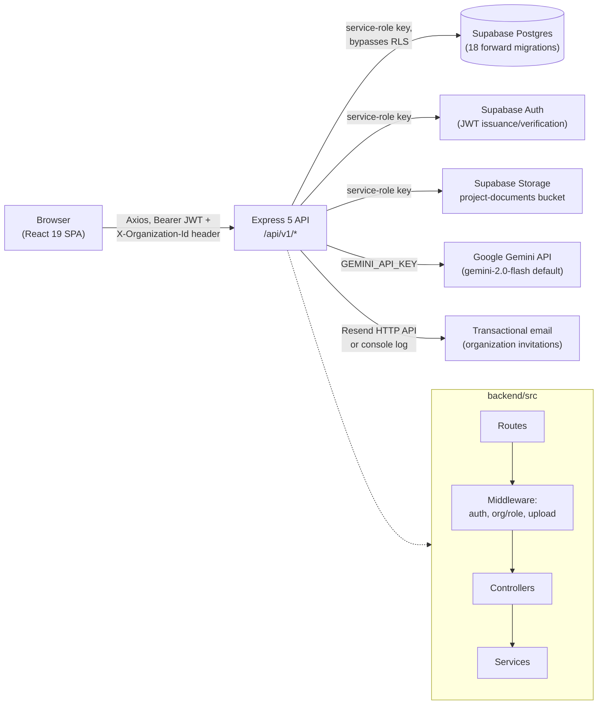
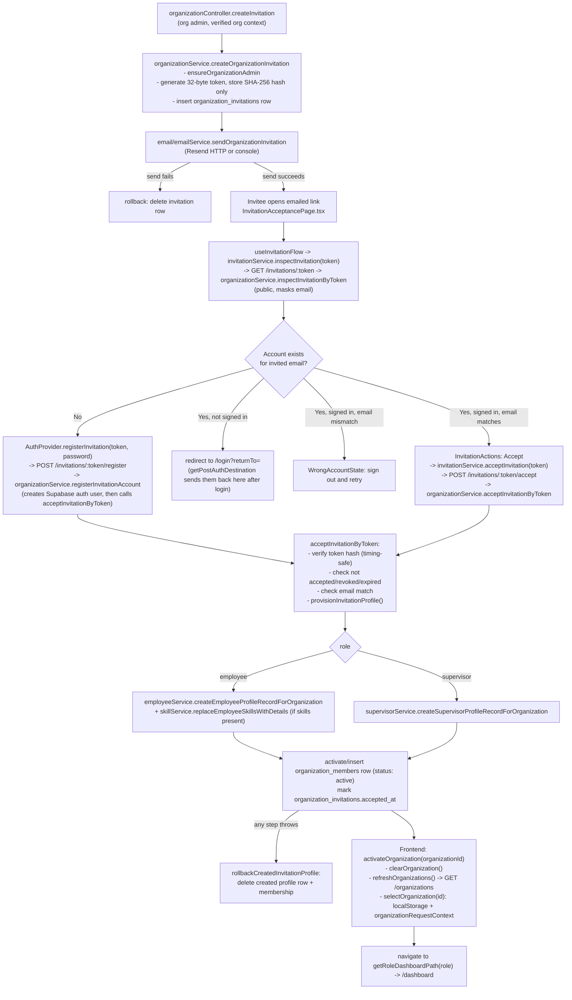
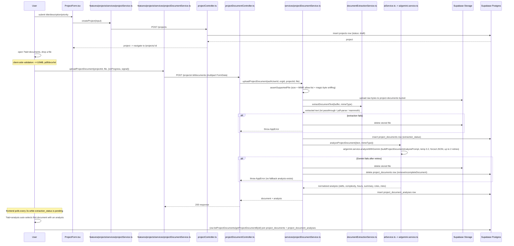

# Supervisor AI — Architecture & Directory Reference

> Onboarding reference for the Supervisor AI codebase. This document explains what exists, how it
> connects, and why — based on a direct reading of the source (routes, controllers, services,
> components, hooks, and the 18 SQL migrations), not on filenames or conventions. Anywhere the
> underlying code was ambiguous or only partially traced, that uncertainty is called out explicitly
> rather than smoothed over.
>
> Generated 2026-09-13 against the working tree at commit `14f736f` (plus an uncommitted fix in
> `backend/src/services/taskService.ts`, see [Known Gaps](#5-known-gaps--tech-debt-context)).

## Table of Contents

1. [Top-Level Overview](#1-top-level-overview)
2. [Directory-by-Directory Breakdown](#2-directory-by-directory-breakdown)
3. [Key Flows as Diagrams](#3-key-flows-as-diagrams)
4. [Database Schema Map](#4-database-schema-map)
5. [Known Gaps / Tech Debt Context](#5-known-gaps--tech-debt-context)

---

## 1. Top-Level Overview

Supervisor AI is a multi-tenant workforce-management platform: organization admins and supervisors
create projects, upload requirement documents that Google Gemini analyzes for required skills and
effort, generate ranked (advisory, never auto-applied) employee recommendations against those
documents, assign work as tasks, and track progress that employees report themselves.

The repository is **not an npm workspace monorepo** — there is no root `package.json` tying the two
sides together. It is two independently-versioned projects living side by side in one Git repo,
plus a `supabase/` directory of forward-only SQL migrations that is the schema source of truth for
both:

```txt
supervisor-ai-new/
  backend/            Node 20 + Express 5 + TypeScript API (ES modules, strict mode)
    src/
      config/         Environment loading, Supabase client construction
      routes/         Express route tables (one file per resource group)
      controllers/    Thin HTTP handlers — parse input, call one service, format response
      middleware/     Auth, org/role resolution, upload parsing, rate limiting, errors
      services/       All business logic and Supabase queries (the real "backend")
      types/          Shared TypeScript contracts
      utils/          AppError, validation helpers, response envelope, logger
      docs/           Hand-written OpenAPI document (partial coverage)
      scripts/        One-off/dev-ops scripts (bootstrap, reset, verification)
  frontend/           Vite + React 19 + TypeScript SPA
    src/
      app/            Providers (React Query, routing) and the router itself
      features/       Feature-sliced modules (auth, projects, tasks, recommendations, …)
      components/     Shared layout/UI primitives (not feature-specific)
      hooks/, services/  Older shared/top-level hooks and API wrappers (see note in §2)
      lib/            Axios client, permissions, query-key factory
      pages/          Thin route-container wrappers around feature modules
      types/          Shared backend response DTOs
  supabase/
    migrations/       18 forward-only SQL migrations — the schema source of truth
    seed.sql, seed_employee_skills_for_recommendation_test.sql
  docker-compose.yml  Backend-only production container definition
```

Both backend and frontend have their own detailed `README.md` files; this document supersedes them
where they've drifted from the actual code (the frontend README in particular still describes an
earlier, largely-placeholder version of the app — see §5).

### Request flow



Two facts drive a lot of the authorization design and are worth internalizing up front:

- **The frontend never talks to Supabase directly** — no `@supabase/supabase-js` client exists
  anywhere under `frontend/src`. Every request goes through the Express API over Axios.
- **The backend's Supabase clients always use the service-role key** (`backend/src/config/supabase.ts`
  creates both `supabase` and `supabaseAuth` with `env.supabaseServiceRoleKey`), which bypasses
  Postgres Row-Level Security entirely. Tenant isolation is therefore enforced by Express
  middleware (`organizationMiddleware.ts`'s `resolveOrganizationContext`/`requireOrganizationRole`)
  and by services filtering every query with a verified `organization_id`, **not** by the RLS
  policies defined in the migrations. See §5 for what this means for the policies that do exist.

---

## 2. Directory-by-Directory Breakdown

### 2.1 `backend/src/config/`

| File | Purpose | Imports / imported by |
| --- | --- | --- |
| `environment.ts` | Loads `.env`, builds a frozen `env` object (port, Supabase URL/service-role key, CORS origins, rate-limit window/max, JSON body limit, `geminiConfigured`). Fails fast at startup if Supabase vars are missing; in production also requires `GEMINI_API_KEY` and forbids `localhost`/`*` CORS origins. | The most widely-depended-on config file — imported by nearly every service, middleware, and `server.ts`. |
| `supabase.ts` | Creates two Supabase clients, `supabase` and `supabaseAuth`, **both using the service-role key** (never a per-user token). All backend DB/Auth access therefore bypasses Postgres RLS — see §4. `supabaseAuth` uses `flowType: "implicit"` for password-recovery tokens arriving via URL fragment. | Imported by almost every service, `authMiddleware.ts`, `healthService.ts`, scripts. |

### 2.2 `backend/src/middleware/`

| File | Purpose | Imports / imported by |
| --- | --- | --- |
| `authMiddleware.ts` | `authenticateUser`: reads `Authorization: Bearer <token>`, calls `supabase.auth.getUser(token)`, sets `req.user` to the Supabase `User`, else throws `AppError(401)`. `authenticateUserIfPresent`: same but tolerates a missing header (used for public invitation preview). | Imports `config/supabase.js`, `utils/appError.js`. Used by 8 of 10 route files. |
| `authValidation.ts` | Request-body validators: `validateRegisterRequest` (blocks privileged fields like `role`/`organization_id`/`skills` at bare registration), `validateSignupRequest` (+ nested skill-object validation for the deprecated legacy path), `validateLoginRequest`, `validatePasswordResetRequest`/`validatePasswordReset`, `validateAdminCreateUserRequest` (branches by target role). | Imports `utils/appError.js`, `utils/validation.js`. Used by `authRoutes.ts`, `adminRoutes.ts`. |
| `roleMiddleware.ts` | `requirePlatformRole(...roles)`: loads the caller's app user via `userService.getAppUserByAuthId`, attaches `req.appUser`, checks `platformRole` (401 if unauthenticated, 403 if mismatched). `requireRole(...)` is a `@deprecated` shim mapping legacy `"admin"` → `"platform_admin"` and delegating to `requirePlatformRole`; passing `"supervisor"`/`"employee"` maps to nothing (silently dropped) — no current call site does this, but it's a latent trap. | Imports `services/userService.js`, `utils/appError.js`, `types/auth.js`. Used by `adminRoutes.ts`; imported but apparently unused (`requireRole`) by `projectRoutes.ts`/`supervisorRoutes.ts`. |
| `organizationMiddleware.ts` | `resolveOrganizationContext`: requires `req.user`, requires the `X-Organization-Id` header, validates its UUID shape, cross-checks against `req.params.organizationId` if present (403 on mismatch), calls `organizationService.resolveOrganizationContextForUser(...)`, populates `req.appUser`/`req.membership`/`req.organization`. `requireOrganizationRole(...roles)`: checks `req.membership.role` (500 if called before `resolveOrganizationContext`). | Imports `services/organizationService.js`, `utils/appError.js`, `utils/validation.js`, `types/organization.js`. Used by dashboard/employee/organization/project/supervisor/task routes. |
| `errorHandler.ts` | `notFoundHandler` (404 catch-all) and `errorHandler` (4-arg Express error middleware): if `AppError`, logs at `warn` and returns `statusCode` with the message **only when `error.expose` is true**, else a generic "Internal server error."; any other thrown value logs at `error` (stack trace outside production only) and always returns a generic 500. | Imports `utils/appError.js`, `utils/apiResponse.js`, `utils/logger.js`. Mounted last in `server.ts`. |
| `observabilityMiddleware.ts` | `requestContext`: assigns/propagates `req.requestId`, times the request, on `finish` increments in-memory `http_requests_total`/`http_errors_total` counters and logs a structured `http_request_completed` line. `incrementMetric()` is a general-purpose in-memory Prometheus-style counter also called by `gemini.service.ts`, `projectDocumentService.ts`, `taskService.ts` for business metrics. `metricsText()` renders counters for `/metrics`. Counters live in an unbounded in-memory `Map` — fine for one process, no cross-instance aggregation. | Imported by `server.ts` and the three service files above. |
| `securityMiddleware.ts` | `securityHeaders`: hand-rolled headers (no helmet) — `X-Content-Type-Options`, `X-Frame-Options: DENY`, `Referrer-Policy`, a restrictive CSP. `rateLimit`: in-memory fixed-window limiter keyed by `${ip}:auth-or-api`, default 120 req/60s, throws `AppError(429)`. **Per-process only** — does not coordinate across replicas and resets on restart. | Imported only by `server.ts`. |
| `uploadMiddleware.ts` | Configures `multer` (memory storage, 10 MB cap, single file, `fileFilter` allow-listing PDF/DOCX/TXT). Exports `uploadProjectDocumentFile` (translates Multer errors to `AppError`) and the `PROJECT_DOCUMENT_BUCKET` constant reused by `projectDocumentService.ts` and `healthService.ts`. | Used only by `projectRoutes.ts`. |

### 2.3 `backend/src/routes/`

All ten route files are thin: `authenticateUser` → (optionally) `resolveOrganizationContext` → `requireOrganizationRole(...)`/`requirePlatformRole(...)` → controller. Notable specifics:

- **`adminRoutes.ts`** — skill-moderation endpoints each carry their own `requirePlatformRole("platform_admin")`; a blanket `router.use(authenticateUser, requirePlatformRole("platform_admin"))` guards everything declared below that line (`/dashboard`, `/users`, `/users/:userId/role`).
- **`organizationRoutes.ts`** — `/invitations/accept` (legacy, deprecated) uses only `authenticateUser`, no org-context middleware, since the org isn't known yet; the header is read manually inside the controller.
- **`taskRoutes.ts`** — `router.use(authenticateUser, resolveOrganizationContext)` once at the top, per-route `requireOrganizationRole` after. Keeps a duplicate `POST /:taskId/progress` alongside the documented `PATCH /:taskId/progress`, commented as retained for existing clients.
- **`healthRoutes.ts`**, **`publicRoutes.ts`** — no auth by design.
- **`invitationRoutes.ts`** — `GET /:token` uses `authenticateUserIfPresent` (anonymous preview); `POST /:token/accept` requires full auth.

### 2.4 `backend/src/controllers/`

Controllers are uniformly thin: validate `req.body`/`params`/`query` via `utils/validation.js`, call exactly one service, wrap the result in `sendSuccess`, and `catch (error) { return next(error); }`. **Every controller rethrows via `next(error)` — none swallow.**

| File | Delegates to | Notable behavior |
| --- | --- | --- |
| `authController.ts` | `services/authService.js` | signup/register/login/me/password-reset. |
| `adminController.ts` | `services/adminService.js`, `services/accountProvisioningService.js`, `services/skillService.js` | user listing/role update, managed-user provisioning, skill moderation. |
| `dashboardController.ts` | `services/dashboardService.js`, then `services/activityLogService.js.logActivity(...)` | fires an (awaited) activity-log write after a successful dashboard fetch. |
| `employeeController.ts` | `services/employeeService.js`, `services/skillService.js`, `services/taskService.js` | has its own local skill-array parser duplicating logic in `authValidation.ts`. |
| `invitationController.ts` | `services/organizationService.js` (`inspectInvitationByToken`, `acceptInvitationByToken`, `registerInvitationAccount`) | |
| `organizationController.ts` | `services/organizationService.js` | org CRUD, membership/invitation listing, invitation CRUD+accept; role-branching input parser rejects employee-only fields for supervisor invites. |
| `projectController.ts` | `services/projectService.js` | CRUD. |
| `projectDocumentController.ts` | `services/projectDocumentService.js` | reads `req.file` (populated by `uploadMiddleware.js`). |
| `publicController.ts` | `services/skillService.js` (`listPublicApprovedSkills`) | unauthenticated. |
| `recommendationController.ts` | `services/recommendationService.js` | validates exactly one of `taskId`/inline `task` is supplied for assignment (XOR check). |
| `supervisorController.ts` | `services/supervisorService.js`, `services/employeeService.js` (`updateEmployeeWorkSettings`) | |
| `taskController.ts` | `services/taskService.js` | passes `req.membership.role` into `listTasks`/`getTaskById`/`createTaskProgress` for role-based branching. |

### 2.5 `backend/src/services/` (business logic — the real backend)

| File | Purpose | Imports / imported by |
| --- | --- | --- |
| `accountProvisioningService.ts` | Three account-creation paths: `signupEmployeeWithProvisioning` (legacy public signup), `registerCustomerAccount` (public register-then-create-org), `provisionManagedUser` (admin-provisions a user). Each does `supabase.auth.admin.createUser`/`inviteUserByEmail` + `users` insert + profile creation, with a manual saga-style `cleanupProvisioning` rollback (not a DB transaction) on failure. | → `employeeService`, `skillService`, `supervisorService`, `userService`. ← `authService`, `adminController`. |
| `activityLogService.ts` | `logActivity()` inserts an `activity_logs` row; **deliberately never throws** — audit failures must not break the underlying operation (`console.warn`s instead). | ← `taskService`, `dashboardController`. |
| `adminService.ts` | Platform-admin user management: `listAppUsers`, `updateAppUserRole` (derives `platform_role` from legacy role), `isValidUserRole`. | ← `adminController`. |
| `ai/gemini.service.ts` | `analyzeWithGemini()` — the sole Gemini integration point. Builds a `GoogleGenAI` client from `GEMINI_API_KEY`/`GEMINI_MODEL` (503 if unconfigured), calls `generateContent` with `buildProjectDocumentAnalysisPrompt`, `temperature: 0.2`, forced JSON. **Retries up to 2 attempts** on any failure, then throws 502. Strictly normalizes the response (complexity enum, hours rounded to 0.25, skill lists deduped/capped at 30/120 chars). Emits `gemini_requests_total`/`gemini_latency_ms_total` metrics. | ← `aiService.ts` only. |
| `ai/promptBuilder.ts` | `buildProjectDocumentAnalysisPrompt()` — pure prompt string builder; truncates document text to 24,000 chars; includes an explicit prompt-injection defense line telling Gemini to treat the document as untrusted data. | ← `ai/gemini.service.ts` only. |
| `aiService.ts` | Thin facade: `analyzeProjectDocument()` just calls `analyzeWithGemini()`. **No local/fallback analysis path exists in code**, despite the top-level README claiming "Gemini API with local fallback analysis" — see §5. | ← `projectDocumentService.ts`. |
| `authService.ts` | `login()` (Supabase password sign-in + app-user context), `signup()` (legacy path, gated by `AUTH_LEGACY_EMPLOYEE_SIGNUP_ENABLED`, else 410 Gone), `register()`, `requestPasswordReset()` (deliberately non-enumerating — always "succeeds," swallows the real Supabase error), `resetPassword()`, `getCurrentAppUser()`. | → `accountProvisioningService`, `userService`. ← `authController`. |
| `dashboardService.ts` | `getSupervisorDashboard()` (org-wide counts/workload/document/recommendation aggregates) and `getEmployeeDashboard()` (self-scoped assignments, stale/blocked/unstarted attention lists, approved-vs-pending skill split). Parallelizes independent queries with `Promise.all`, joins in-memory via `Map`s. | → `employeeMetricsService`, `skillService` (`getEmployeeSkills`), `userService`. ← `dashboardController`. |
| `documentExtractionService.ts` | `extractDocumentText()` — strategy dispatch by MIME type: plain-text passthrough, `pdf-parse` for PDF, `mammoth` for DOCX. 400 for unsupported types, 422 if extraction yields empty text. | ← `projectDocumentService.ts` only. |
| `email/emailService.ts` | Provider abstraction selected by `TRANSACTIONAL_EMAIL_PROVIDER`: `"resend"` (real HTTP POST, HTML-escapes interpolated values, 502 on failure — no silent fallback), `"console"` (dev logging), anything else → 503. Sole capability: `sendOrganizationInvitation`. | ← `organizationService.ts` only. |
| `email/invitationUrl.ts` | `buildOrganizationInvitationAcceptanceUrl()` — builds the `/invitations/accept?token=...` URL from `FRONTEND_APP_URL`, validating it's well-formed http/https. | ← `organizationService.ts` only. |
| `employeeMetricsService.ts` | Shared capacity math: `availabilityFromWorkload`, `calculateWorkloadPercentage`, `enrichEmployeesWithCapacityMetrics` (sums active-task `estimated_hours`; active = `todo`/`in_progress`/`blocked`/`review`). | ← `taskService`, `dashboardService`, `recommendationService`, `supervisorService`, and partially `employeeService` (see §5 duplication note). |
| `employeeService.ts` | Employee profile CRUD (`createEmployeeProfileRecordForUser/ForOrganization`, `getEmployeeProfileByAuthId`, `createEmployeeProfile`, `updateEmployeeProfile` — also replaces skills via `skillService.replaceEmployeeSkillsWithDetails`), `updateEmployeeWorkSettings` (triggers its own local `recalculateEmployeeCapacity`). | → `employeeMetricsService`, `userService`, `skillService`. ← `accountProvisioningService`, `organizationService`, `employeeController`, `supervisorController`. |
| `healthService.ts` | `getDependencyHealth()` — parallel-pings the `users` table and Storage bucket listing; reports `gemini` status by config presence only (not a live ping); reports `process.uptime()`. | → `environment.js`, `uploadMiddleware.js` (bucket name). ← `healthRoutes.ts`, `server.ts`. |
| `organizationService.ts` | The largest service (~1880 lines). Org creation/listing, and the **entire invitation lifecycle**: `createOrganizationInvitation` (random 32-byte token, stores only its SHA-256 hash, sends email, rolls back the row on send failure), `inspectInvitationByToken` (public, masks email), `acceptInvitationByToken` (token-based acceptance, provisions the profile, rolls back on failure), `registerInvitationAccount` (creates a brand-new Supabase user from a token+password then accepts), `resendOrganizationInvitation` (60s cooldown), `revokeOrganizationInvitation`, and a **second, separate** `acceptOrganizationInvitation` (in-app acceptance for an already-authenticated user with an `invited` membership, looked up by org id rather than token — re-implements profile provisioning inline instead of reusing `provisionInvitationProfile`, and has no compensating rollback on failure unlike the token path). Uses `timingSafeEqual` for token comparison. Also has a JSONB-embedded-metadata compatibility shim (`__invitation_meta`) for databases missing the dedicated token columns. | → `employeeService`, `skillService`, `supervisorService`, `email/emailService`, `email/invitationUrl`, `userService`. ← `organizationController`, `invitationController`. |
| `projectDocumentService.ts` | Upload pipeline: validates file (size, MIME allow-list, **magic-byte content sniffing** — `%PDF-` header, ZIP signature for docx, no-null-bytes heuristic for text — to catch MIME spoofing), uploads to Storage, extracts text, inserts `project_documents`, calls Gemini analysis, inserts `project_document_analyses`. **Any failure after the storage upload deletes everything already created** — a document that fails analysis is not left half-persisted; the user must re-upload. | → `aiService`, `documentExtractionService`, `projectService` (`ensureProjectExistsInOrganization`), `userService`, `observabilityMiddleware` (`incrementMetric`). ← `projectDocumentController`. |
| `projectService.ts` | Straightforward `projects` CRUD, scoped by `organization_id`, soft-delete-aware. `required_skills` stored as a plain `text[]` column with an explicit `// TODO: migrate to project_required_skills` comment — unlike employee skills, which use a normalized join table. `deleteProject()` is a soft delete. `ensureProjectExistsInOrganization()` is a shared guard reused by three other services. | → `userService`. ← `projectController`, `projectDocumentService`, `recommendationService`, `taskService`. |
| `recommendationService.ts` | See Flow 4 (§3) for the exact scoring algorithm. Also handles persistence (`generateProjectRecommendations`), retrieval (`getLatestProjectRecommendations`), and `assignRecommendedEmployee` (validates the employee belongs to the run, then either assigns an existing task or creates one via `taskService`). Defines its own local `getEmployeeSkills`/`normalizeSkill`/`uniqueSkills`, duplicating `skillService.ts`'s equivalents. | → `employeeMetricsService`, `projectService`, `taskService` (`assignTask`, `createTask`, `getTaskById`), `userService`. ← `recommendationController`. |
| `skillService.ts` | Skill catalog + employee-skill linking. `is_approved` is a **catalog-curation flag** (`true` = vetted for global/autocomplete display), still applied in `resolveEmployeeSkills`'s global lookup, `listApprovedSkills(ForOrganization)`, `listPublicApprovedSkills`, and the moderation queue (`listPendingSkills`/`approveSkill`/`rejectSkill`). **Confirmed current state:** `getEmployeeSkills()` and `getSkillsByEmployeeIds()` — the functions that fetch an employee's *own* linked skills — do **not** filter by `is_approved`, matching the `011ea7e` fix. New skills always start `is_approved: false`. `replaceEmployeeSkillsWithDetails()` is the shared entry point used by onboarding/invitation/profile-edit flows. | → nothing beyond `config`/`utils`. ← `employeeService`, `organizationService`, `accountProvisioningService`, `supervisorService`, `dashboardService`, `adminController`, `employeeController`, `publicController`. |
| `supervisorService.ts` | Supervisor profile CRUD (mirrors `employeeService.ts`) plus `listAssignableEmployees()` — the directory search supervisors use for task assignment (a **third** independent copy of skill-name normalization, `normalizeSkillFilter`). | → `employeeMetricsService`, `skillService` (`getSkillsByEmployeeIds`), `userService`. ← `accountProvisioningService`, `organizationService`, `supervisorController`. |
| `taskProgressMetrics.ts` | `statusForProgress()`/`projectProgressFromHours()` — pure functions with their own test file. **Confirmed dead in production**: `taskService.ts` does not import this file; it re-implements the identical ternary logic inline. The test suite pins behavior the real runtime path never exercises through this module. | Imported by nothing except its own test. |
| `taskService.ts` | Core task lifecycle: `createTask`, `updateTask`, `assignTask` (all trigger a non-blocking, error-swallowing `recalculateEmployeeCapacity` follow-up), `createTaskProgress` (validates the actor is the assignee when role is `employee`; derives next status purely from `progressPercentage` — 0→todo, 100→completed, else→in_progress, **bypassing `blocked`/`review`/`cancelled` entirely**; triggers non-blocking capacity+performance recalculation; blockingly recalculates project progress; logs to `activityLogService`), `listTasks`/`getTaskById` (see Flow 5, §3 for the recently-fixed bug). | → `employeeMetricsService`, `projectService`, `userService`, `activityLogService`, `observabilityMiddleware`. ← `taskController`, `employeeController` (`listEmployeeTasks`), `recommendationService`. |
| `userService.ts` | Thin, heavily-reused identity layer: `getAppUserByAuthId()` (Supabase-Auth-id → app `users` row, 404 if missing — called at the top of nearly every other service as an existence/auth guard), `getAuthOnboardingStateForAppUser()`, `assertPlatformRole()`, `mapLegacyCompatibilityRole()` (a `role:"admin"`+`platform_role:null` user reports legacy role as `null`, not `"admin"` — an undocumented migration-compatibility quirk). | The most widely-depended-on services file — imported by essentially every other service. |

### 2.6 `backend/src/utils/`

| File | Purpose | Notes |
| --- | --- | --- |
| `appError.ts` | `AppError extends Error` with `statusCode` (default 500) and `expose` (**default `true`**). Because of that default, most `AppError` messages are sent verbatim to clients unless a call site explicitly passes `false` — only 2 call sites in the entire backend do so. Any new `throw new AppError(...)` leaks its message by default. | `isAppError()` type guard. |
| `apiResponse.ts` | `sendSuccess`/`sendError` producing the uniform `{ success, message, data\|error }` envelope. | Imported by every controller. |
| `logger.ts` | Minimal structured JSON logger (`info`/`warn`/`error`). **Used only by `errorHandler.ts`** — the rest of the codebase logs via raw `console.log`/`warn`/`error`, several hand-rolling JSON, several as plain strings. Logging format is inconsistent across the backend. | |
| `validation.ts` | Shared `require*`/`optional*` body/query parsers (`requireString`, `requireEmail`, `requireUuid`, `optionalNumber`, `optionalEnum`, `optionalDate`, ...), each throwing `AppError(400)`. Two parallel families exist — body-object parsers vs. arbitrary-value parsers for query strings — intentional given differing input shapes. | Imported by nearly every controller and by `authValidation.ts`/`organizationMiddleware.ts`. |

### 2.7 `backend/src/types/`

Pure type-only files. `auth.ts` marks `UserRole`/`role` as `@deprecated` aliases of the newer `platformRole` + per-organization `membership.role` model — evidence the codebase is mid-migration off a single global role enum (also visible in `roleMiddleware.ts`'s `requireRole` shim). `express.d.ts` augments `Express.Request` with `requestId`/`appUser`/`membership`/`organization`/`user`, which is what lets every downstream middleware/controller read `req.organization` etc. without casting. `ai.ts`'s `EmployeeRecommendationResult` carries both a "new" and "legacy-compat" field set with a comment saying the legacy fields are "retained while frontend consumers transition" — this is the backend-side twin of the frontend field-name mismatch noted in §5. `document.ts`'s MIME allow-list is a second, independent source of truth from `uploadMiddleware.ts`'s array (must be kept in sync by hand). Remaining files (`organization.ts`, `project.ts`, `task.ts`, `employee.ts`, `dashboard.ts`, `provisioning.ts`) are domain DTOs/enums with no runtime logic.

### 2.8 `backend/src/docs/openapi.ts`

A **hand-written**, not auto-generated, OpenAPI 3.1 document covering only 6 of the ~40 actual routes (`/health`, `/ready`, `/tasks/{taskId}`, `/tasks/{taskId}/progress`, `/employees/me/tasks`, `/employees/me/dashboard`, `/supervisors/dashboard`). Served via Swagger UI at `/api/docs` and raw JSON at `/api/openapi.json`. Most of the API surface (auth, organizations, invitations, projects, recommendations, admin) has no OpenAPI coverage — treat it as a partial reference, not a contract.

### 2.9 `backend/src/server.ts` — exact middleware order

1. `app.disable("x-powered-by")`
2. `requestContext` (assigns request ID, starts timing)
3. `securityHeaders`
4. `cors(...)` (origin allowlist from `env.corsOrigins`, `credentials: true`, methods GET/POST/PATCH/DELETE, allowed headers `Authorization, Content-Type, X-Organization-Id, X-Request-Id`)
5. `express.json({ limit: env.jsonLimit })`
6. `rateLimit`
7. Inline routes: `GET /`, `/health`, `/ready`, `/metrics`, `/api/openapi.json`, `/api/docs`
8. Ten `app.use("/api/v1/...")` route mounts
9. `notFoundHandler`
10. `errorHandler`

`/health`, `/ready`, `/metrics`, and `/api/docs` are mounted before any route-level auth, so they're unauthenticated but still subject to the global `rateLimit`.

### 2.10 Frontend top-level: `app/`, `lib/`, `hooks/`, `services/`, `components/`, `layouts/`, `pages/`, `config/`, `types/`

**`app/`**
- `main.tsx` / `App.tsx` — entry point and root composition.
- `app/providers/AppProviders.tsx`, `QueryProvider.tsx` — wraps the app in `QueryClientProvider` (React Query).
- `app/router/AppRouter.tsx` — the actual route tree. Public: `/`, `/invitations/accept`, `/login`, `/forgot-password`, `/reset-password`, `/register`, `/signup`. Everything else is nested inside `<ProtectedRoute>` (redirects unauthenticated users); within that, a `platform_admin`-only branch (`<RoleGuard allowedRoles={['admin']}>`) covers `/platform-admin` and `/admin/users/new`, and a main branch wrapped in `<AppLayout>` contains `/forbidden`, `/select-organization`, and — nested inside `<OrganizationRoute>` (requires an active org, sometimes with `allowedRoles`) — `/dashboard` (further wrapped by `DashboardEntryRoute`), `/tasks`, `/profile`, `/projects`, `/projects/:projectId`, `/ai-recommendations` (admin/supervisor only), `/employees` (supervisor only), `/team` and `/organization/invitations` (admin only). Catch-all `*` → `NotFoundPage`.

**`lib/api/`** — the real HTTP layer:
- `constants.ts` — `API_BASE_URL` (from `VITE_API_BASE_URL`, default `/api/v1`).
- `errors.ts` — `ApiError` class + `parseApiError()` normalizing Axios/plain errors against the backend's `{success:false,error,message}` envelope.
- `pagination.ts`, `queryKeys.ts` (centralized React Query key factory), `request.ts` (`getJson`/`postJson`/`patchJson`/`deleteJson`/`postFormData` — each unwraps the `ApiResponse` envelope and throws a plain `Error` on `success:false`).
- `index.ts` — barrel re-exporting everything except `queryKeys.ts` (imported directly elsewhere); the actual import path used by ~18 files.
- `lib/permissions/index.ts` — a closed `Permission` union mapped to allowed organization-membership roles; `hasPermission()` special-cases `admin:users:write` against `platformRole`. Only consumed by `config/navigation.ts`.
- `lib/utils.ts` — exports `cn()` (clsx + tailwind-merge). **Confirmed dead code — zero importers anywhere in `frontend/src`.**

**`services/api.ts`** — the single shared Axios instance. Request interceptor attaches `Authorization: Bearer <token>` (from `features/auth/utils/tokenStorage`) and `X-Organization-Id` (from `features/organizations/utils/organizationRequestContext`'s module-level active-org variable), unless the request opts out via `skipOrganizationContext: true` or the URL matches an exclusion list (`/auth/*`, `/public/*`, `/invitations/*`, `/organizations`). Response interceptor: on any `401`, clears tokens and dispatches a session-expired event — **does not itself navigate**; that's deliberately left to `ProtectedRoute` so public routes stay reachable during expiry handling.

**Top-level `services/` — re-export direction is inconsistent by domain** (confirmed by import grep):
- **Real implementation lives at the top level**, with the matching `features/*/services/` file (where one exists) re-exporting from it: `services/auth/authService.ts`, `services/employees/employeeService.ts`, `services/recommendations/recommendationService.ts`, `services/skills/skillService.ts`, `services/supervisors/supervisorService.ts`, `services/admin/adminUserService.ts`.
- **Inverted — the feature-level file is real, the top-level file is a dead re-export shim with zero importers**: `services/tasks/taskService.ts` (real impl at `features/tasks/services/taskService.ts`), `services/projects/projectService.ts` (real impl at `features/projects/services/{projectService,projectDocumentService}.ts`).

**Top-level `hooks/`** — a mix of live shared infrastructure and confirmed-dead legacy hooks:
- **Live**: `useApiResource.ts` (hand-rolled fetch/loading/error state machine with stale-response guarding — the "legacy" data-fetching pattern, still used by most features), `useNotifications.ts` (context consumer, used broadly), `useEmployeeProfile.ts`, `useSupervisorProfile.ts`.
- **Dead (zero importers found)**: `useEmployees.ts`, `useTask.ts`, `useTasks.ts` (1-line re-export shim), `useProjectRecommendations.ts` (single-arg signature, superseded by the react-query-based two-arg `features/projects/hooks/useProjectRecommendations.ts`). `useProject.ts`/`useProjects.ts` at top level are also just re-export shims, with no confirmed importer of the top-level path itself.
- **Architectural note**: the app currently runs **two coexisting, non-interoperable data-fetching patterns** — the legacy `useApiResource` hook (used by account-creation, ai-recommendations, admin-users, employees, invitations, organizations, supervisors, platform-admin, most of tasks) and TanStack React Query (`AuthProvider`, `useSupervisorDashboard`, `useOrganizationTeam`, and most of `features/projects/hooks/*`). This reads as an in-progress migration, not an intentional split.

**`components/layout/`** — `PageShell.tsx` (desktop-fixed sidebar + mobile Radix-Dialog sidebar, renders `Header`+children), `Header.tsx` (presentational title/eyebrow/actions), `Sidebar.tsx` (logo + nav list + arbitrary children slot, used for `OrganizationSwitcher`), `Container.tsx` (max-width wrapper). `layouts/AppLayout.tsx` is the actual composition root: reads `useAuth()`+`useOrganization()`, computes page title from a hardcoded `routeTitles` map, builds nav items via `config/navigation.ts`, renders `PageShell` with a sign-out action and `<OrganizationSwitcher>` as sidebar content, plus the routed `<Outlet/>`.

**`components/shared/`** — `EmptyState.tsx` (+ `ProjectsEmptyState`/`TasksEmptyState`/`EmployeesEmptyState` convenience wrappers), `ErrorState.tsx` (falls back to `getFriendlyApiErrorMessage()` when no explicit message given), `LoadingState.tsx`, three `Skeleton*` presentational placeholders, and `notifications/` (`NotificationProvider.tsx` — toast state manager, auto-dismiss 4.5–6.5s by variant, caps at 4 visible; `NotificationViewport.tsx` — renders the stack, consumes the **top-level** `hooks/useNotifications.ts`).

**`components/ui/`** — small dependency-light primitives: `Button.tsx`, `Card.tsx`, `DataTable.tsx` (generic typed table), `Dialog.tsx` (Radix wrapper, used by `PageShell` and feature dialogs), `FormField.tsx`, `MetricCard.tsx`, `StatusBadge.tsx`, `SupervisorLogo.tsx`.

**`config/navigation.ts`** — static nav item list gated per-item by `lib/permissions`, plus conditional `/team` (org admins) / `/employees` (supervisors) entries. Only consumed by `AppLayout.tsx`.

**`pages/`** — every file is a near-1-line wrapper rendering one `features/*` component; none import top-level `hooks/`/`services/` directly. Exceptions with real logic: `LandingPage.tsx` (marketing page, CTA driven by `useAuth`), `NotFoundPage.tsx` (redirect logic via `useAuth`+`useNavigate`), `ForbiddenPage.tsx`, `RegisterOrganizerPage.tsx` (full org-creation form, `react-hook-form`+`zod`, calls `features/organizations/services/organizationService.createOrganization`), `ProfilePage.tsx` (branches `EmployeeProfileModule` vs `SupervisorProfileModule` by `useOrganization()`), `OrganizationInvitationsPage.tsx`, `SelectOrganizationPage.tsx`.

**`types/api.ts`** — generic envelope types (`ApiResponse<T>`, `PaginatedResponse<T>`) used by `lib/api/request.ts`/`errors.ts`. **`types/backend.ts`** — a 778-line, **hand-maintained** (no codegen) mirror of backend DTOs: every role/status enum plus ~70 interfaces for auth, profiles, projects, tasks, documents/analysis, recommendations, dashboards, organizations/invitations. This is the single source of truth for frontend API typing; there is **no shared types package** between `backend/` and `frontend/`, so a backend DTO change requires a manual, unenforced sync here.

### 2.11 `frontend/src/features/`

Each feature folder generally follows `components/`, `hooks/`, `services/`, `types/`, `utils/`, `pages/` (not all present in every feature). Notable cross-feature imports are called out explicitly — this codebase is *not* strictly feature-isolated.

**`features/auth/`** — `hooks/authContext.ts`+`useAuth.ts` (context/hook pair), `hooks/useEmployeeSignupForm.ts` (owns the 4-step signup wizard state, delegates skill-catalog data to `features/account-creation`). `components/AuthProvider.tsx` is the real context provider: hydrates from a stored token via `getCurrentUser()` on mount, listens for a `supervisor-ai:auth-session-expired` window event to clear session, and implements `login`/`signup`/`register`/`registerInvitation` (all persist tokens via `tokenStorage` then set `user`/`onboarding` state) and `logout` (clears tokens, clears the React Query cache, navigates to `/login`). `LoginForm.tsx`, `SignupForm.tsx` (renders the wizard), `RegisterForm.tsx` (dual-purpose — detects an embedded invitation `token=` in `returnTo` and calls `registerInvitation` instead of `register`, via ad hoc regex parsing rather than a shared utility), `ForgotPasswordForm.tsx`/`ResetPasswordForm.tsx` (call the top-level `services/auth/authService.ts` directly, bypassing `AuthProvider`/context since these are unauthenticated flows), `ProtectedRoute.tsx`, `RoleGuard.tsx` (treats `platformRole === 'platform_admin'` as an implicit `'admin'` role). `services/authService.ts` is a **pure re-export barrel** of the top-level `services/auth/authService.ts` (omits `requestPasswordReset`/`confirmPasswordReset`, which the two password components import directly from the top-level path instead). `utils/tokenStorage.ts` owns all `localStorage` token access and the session-expiry custom event.

**`features/organizations/`** — `services/organizationService.ts` (`listCurrentUserOrganizations`, `listOrganizationMembers`, `createOrganization`). `components/OrganizationProvider.tsx` loads orgs post-auth, auto-selects a single active membership or a stored preference, exposes `selectOrganization`/`refreshOrganizations`/`clearOrganization`. `OrganizationRoute.tsx` gates on having an active org (else `OrganizationAccessState` or redirect to `/select-organization`) and optionally on `allowedRoles`. `OrganizationAccessState.tsx` — confirmed the "Use invitation link" button for invited orgs is permanently `disabled`, meaning acceptance can only happen via the emailed link, never from this in-app screen. `utils/organizationRequestContext.ts` holds the **module-level (non-React-state) active-org-id variable** that `services/api.ts`'s interceptor reads, plus `shouldSkipOrganizationHeader()`'s exclusion-path logic. `utils/organizationStorage.ts` persists the selection to `localStorage`. `utils/roleRedirect.ts` maps all three membership roles to `/dashboard`.

**`features/invitations/`** — `services/invitationService.ts` (`inspectInvitation`, `acceptInvitation`, org-scoped invitation CRUD). `components/InvitationAcceptancePage.tsx` is the full acceptance orchestrator (see Flow 2, §3). `InviteMemberDialog.tsx` (org-admin-only creation form), `PendingInvitationsList.tsx` (resend/revoke, uses `window.confirm()` before revoking). `utils/invitationNavigation.ts` — `sanitizeInternalReturnTo` (open-redirect defense: same-origin, single-leading-slash only), `getPostAuthDestination` (shared by `LoginForm` and `RegisterForm`).

**`features/employees/`** — `EmployeeDirectory.tsx` (org-wide directory for supervisors/admins) is **powered by `features/tasks/hooks/useAssignableEmployees`**, not a dedicated employees data source. `EmployeeProfileModule.tsx`+`EmployeeProfileCard.tsx` split `profile.skills` into approved/pending by `skill.isApproved` — the direct UI reflection of the backend's catalog flag. `hooks/useEmployeeProfileEditor.ts` builds a diff-only update payload and does optimistic UI updates with rollback on failure.

**`features/dashboard/`** — `services/dashboardService.ts` (`getSupervisorDashboard`/`getEmployeeDashboard`). `hooks/useSupervisorDashboard.ts` uses React Query directly (30s staleTime); `hooks/useEmployeeDashboard.ts` uses the legacy `useApiResource` hook instead — **the two dashboard hooks in the same feature use different data-fetching abstractions.** `SupervisorDashboardModule.tsx` is the largest dashboard view (metric cards, project-progress, employee-workload with a lazy-loaded Recharts bar chart, task-status breakdown, document/recommendation summaries) and cross-imports presentation helpers from `features/projects` and `features/tasks`.

**`features/team/`** — `useOrganizationTeam.ts` reuses `features/organizations/services/organizationService.listOrganizationMembers` rather than owning its own data source; `OrganizationTeamDirectory.tsx` filters/searches client-side.

**`features/platform-admin/`**, **`features/admin-users/`** — platform-wide user listing (via the top-level employee service) and a managed-user creation wizard that structurally mirrors the employee signup wizard, sharing `features/account-creation`'s step/validation utilities.

**`features/account-creation/`** — shared by `SignupForm` and `AdminUserCreateModule`. `hooks/useApprovedSkillCatalog.ts` calls `services/skills/skillService.listPublicApprovedSkills()` — **this is the frontend's direct counterpart of the backend's `is_approved=true` public-catalog listing** (a different query path from the employee-own-skills query that the `011ea7e` fix touched). `utils/accountCreationForm.ts` holds shared validation/step-building/payload-building logic for both wizards.

**`features/supervisors/`** — self-service supervisor profile (no skills, unlike employees), mirrors the employee profile editor's create-vs-update branching.

**`features/projects/`** — `services/projectService.ts` (CRUD), `services/projectDocumentService.ts` (`uploadProjectDocument` builds `FormData`, uses `postFormData` with upload-progress + `AbortSignal` support). `hooks/useProjectDocuments.ts` **polls every 3s** while any document has `extraction_status === 'pending'`. `hooks/useProjectRecommendations.ts` imports its data functions from the **top-level** `services/recommendations/recommendationService`, not from `features/ai-recommendations/services/`. `ProjectDetailsModule.tsx` (routed detail page, tabs via URL search params) and `ProjectsModule.tsx` (routed list page) each own their **own independent** create/edit/delete state rather than using `hooks/useProjectManager.ts`+`components/ProjectPanel.tsx` — that manager/panel pair appears to be an earlier, now-superseded design (no confirmed importer from the live routed pages). `ProjectRecommendationsSection.tsx` renders recommendations via `ProjectRecommendationCard`, reading fields `rank`/`fullName`/`score`/`matchedRequiredSkills`/`missingRequiredSkills`/`scoreBreakdown.*`. `RecommendationAssignmentDialog.tsx` calls `assignProjectRecommendation` (top-level service) and invalidates recommendation/project/task/dashboard query keys.

**`features/tasks/`** — `services/taskService.ts` (`listTasks`, `createTask`, `assignTask`, `createTaskProgress`). `hooks/useAssignableEmployees.ts` calls the **top-level** `services/supervisors/supervisorService.listAssignableEmployees`. `hooks/useTaskManager.ts` is the central page state machine (computes `canManageTasks` vs `canUpdateProgress` by role) and is **actively used** by `TasksModule.tsx` — unlike the projects feature's equivalent, the tasks feature's manager/panel pattern (`TaskPanel.tsx`) is live. `TaskAssignmentSection.tsx` renders each candidate's availability/workload/performance/skills before selection.

**`features/ai-recommendations/`** — `services/recommendationService.ts` is a **thin facade**: delegates project/document listing to `features/projects/services/*`, employee listing to the top-level supervisor service, and generation/retrieval to the same top-level `services/recommendations/recommendationService` that `features/projects/hooks/useProjectRecommendations.ts` uses. `AiRecommendationResultCard.tsx` renders results using a **different field set** than `ProjectRecommendationCard.tsx` — `employeeName`/`matchScore`/`confidenceScore`/`matchedSkills`/`missingSkills` vs. the other card's `fullName`/`score`/`matchedRequiredSkills`/`missingRequiredSkills` — see §5. "Open task assignment" in `AiRecommendationsModule.tsx` navigates to `/tasks` with `{employeeId, projectId, source}` in router state, but `TasksRoute.tsx` only reads `selectedTaskId` from that state — the hand-off does not currently pre-select anything.

---

## 3. Key Flows as Diagrams

### 3.1 Authentication — login → token issuance → `authenticateUser` middleware

```mermaid
sequenceDiagram
  participant U as User
  participant LF as LoginForm.tsx
  participant AP as AuthProvider.tsx
  participant SVC as services/auth/authService.ts
  participant AX as services/api.ts (Axios)
  participant RT as authRoutes.ts
  participant VAL as authValidation.validateLoginRequest
  participant CTRL as authController.loginUser
  participant ASVC as services/authService.login
  participant SB as Supabase Auth

  U->>LF: submit email+password
  LF->>AP: useAuth().login(credentials)
  AP->>SVC: login(credentials)
  SVC->>AX: postJson("/auth/login", body)
  AX->>RT: POST /api/v1/auth/login
  RT->>VAL: validateLoginRequest (requireEmail/requirePassword)
  VAL->>CTRL: loginUser(req)
  CTRL->>ASVC: login({email,password})
  ASVC->>SB: supabaseAuth.auth.signInWithPassword(...)
  SB-->>ASVC: session (access+refresh JWT) or error
  ASVC->>ASVC: buildAuthUserContext() -> userService.getAppUserByAuthId + onboarding state
  ASVC-->>CTRL: {user, onboarding, accessToken, refreshToken, expiresAt}
  CTRL-->>AX: sendSuccess(200, session)
  AX-->>SVC: unwrapped AuthSession
  SVC-->>AP: AuthSession
  AP->>AP: tokenStorage.storeAuthTokens(access, refresh); setUser/setOnboarding
  AP-->>LF: resolve
  LF->>LF: navigate via getPostAuthDestination()

  Note over U,SB: Subsequent authenticated request
  U->>AX: any protected call (Axios interceptor attaches Authorization: Bearer <token> + X-Organization-Id)
  AX->>RT: request to a protected route
  RT->>RT: authMiddleware.authenticateUser
  RT->>SB: supabase.auth.getUser(token)
  SB-->>RT: Supabase User or 401
  RT->>RT: req.user = user; (optionally) organizationMiddleware.resolveOrganizationContext -> req.appUser/membership/organization
  RT->>CTRL: roleMiddleware/requireOrganizationRole gate, then controller runs
```

On any `401`, `services/api.ts`'s response interceptor clears tokens and dispatches the `supervisor-ai:auth-session-expired` window event; `AuthProvider` listens for it and clears session state, but the actual redirect is left to `ProtectedRoute`/`RoleGuard` reacting to the now-unauthenticated state, not to the interceptor itself.

### 3.2 Organization invitation → acceptance → profile creation

Two independent acceptance paths exist and are both live:



A **second, separate** acceptance path exists for an already-authenticated user with a pending `invited` membership and no token in hand: `organizationService.acceptOrganizationInvitation(authUserId, organizationId)` — it re-implements the same employee/supervisor profile-creation steps inline rather than calling `provisionInvitationProfile()`, and has **no compensating rollback** on failure (unlike the token path's `rollbackCreatedInvitationProfile`). The in-app `OrganizationAccessState.tsx` screen has this path's trigger button permanently disabled in the current UI, so in practice only the emailed-link (token) path is reachable from the frontend today — confirmed by reading the component, not just inferred.

### 3.3 Project creation → document upload → Gemini analysis → `project_document_analyses`



### 3.4 Recommendation scoring — employee skills → matching → weighted score

```mermaid
flowchart TD
  A["recommendationController.generate\nPOST /projects/:id/recommendations"] --> B["recommendationService.generateProjectRecommendations"]
  B --> C["getLatestAnalysis(projectId)\n(400 if none exists)"]
  C --> D["getEmployees(organizationId)\n+ employeeMetricsService.enrichEmployeesWithCapacityMetrics\n(live workload/availability)"]
  D --> E["getEmployeeSkills(employeeIds)\n(recommendationService's own local query —\nNOT skillService.getSkillsByEmployeeIds,\nnever filtered by is_approved, independent of the\n011ea7e fix)"]
  E --> F["scoreEmployee(employee, employeeSkills, analysis) — per employee"]

  F --> F1["uniqueSkills(): dedupe/normalize required + preferred\nskill lists from the analysis; drop overlap from preferred"]
  F1 --> F2["splitSkillMatches(): fuzzy substring match in EITHER\ndirection (normalized employee skill vs target) —\ncan false-positive e.g. 'java' vs 'javascript'"]
  F2 --> F3["Weighted components (each null if not applicable,\nexcluded from both numerator and denominator when null):\n requiredSkillMatch %          weight 50\n preferredSkillMatch %         weight 15\n availabilityPercentage        weight 15\n performanceScore              weight 10\n proficiencyScore (matched avg) weight 5\n experienceScore (matched avg)  weight 5"]
  F3 --> F4["weightedScore = sum(score*weight) / sum(weight of non-null components)"]
  F4 --> F5["suitability: strong (score>=75 AND zero missing required),\nmoderate (score>=50), else weak"]
  F4 --> F6["confidenceScore = min(95, 55 + (required-or-preferred match %) * 0.4)\n(separate heuristic, not part of the weighted formula)"]

  F5 --> G["sort desc by score (ties by name), rank 1..n"]
  F6 --> G
  G --> H["insert one ai_recommendations row per employee\nunder one shared recommendation_run_id"]
  H --> I["GET /projects/:id/recommendations -> getLatestProjectRecommendations"]
  I --> J["assignRecommendedEmployee: verify (run_id, employee_id) pair exists,\nthen taskService.assignTask (existing task) OR taskService.createTask (new task)"]
```



### 3.5 Task creation → assignment → progress tracking

```mermaid
sequenceDiagram
  participant U as User (manager)
  participant TF as TaskForm.tsx
  participant TS_FE as features/tasks/services/taskService.ts
  participant TC as taskController.ts
  participant TSvc as services/taskService.ts
  participant DB as Supabase Postgres
  participant EMP as employeeMetricsService
  participant TAS as TaskAssignmentSection.tsx
  participant PF as TaskProgressForm.tsx (employee)

  U->>TF: create task (title, project, priority, estimated hours)
  TF->>TS_FE: createTask(input)
  TS_FE->>TC: POST /tasks
  TC->>TSvc: createTask(authUserId, orgId, input)
  TSvc->>DB: ensureProjectExistsInOrganization; ensureEmployeeExists (if assignee given)
  TSvc->>DB: insert tasks row (status: todo, estimated_hours default 1)
  TSvc-->>TSvc: runNonBlockingTaskFollowUp -> recalculateEmployeeCapacity (errors only console.warn'd)
  TSvc->>TSvc: recalculateProjectProgress (BLOCKING — throws on failure)
  TSvc-->>TC: task
  TC-->>TF: 200

  U->>TAS: pick an assignee (search/skill/availability/employment-type filters,\nbacked by supervisorService.listAssignableEmployees)
  TAS->>TC: PATCH /tasks/:id/assign {employeeId}
  TC->>TSvc: assignTask(...)
  TSvc->>DB: update assigned_employee_id/assigned_at
  TSvc-->>EMP: recalc capacity for OLD assignee (freed) and NEW assignee (added), non-blocking

  Note over PF: Employee-facing progress update
  PF->>TC: PATCH /tasks/:id/progress {progressPercentage, notes, status}
  TC->>TSvc: createTaskProgress(authUserId, orgId, taskId, input, membershipRole)
  TSvc->>TSvc: if role=employee, verify caller IS assigned_employee_id (else 403)
  TSvc->>DB: insert task_progress row (append-only)
  TSvc->>TSvc: derive status purely from % (0->todo, 100->completed, else->in_progress;\nblocked/review/cancelled are NOT reachable via this path)
  TSvc->>DB: update tasks.status / completed_at
  TSvc-->>EMP: recalc capacity + recalculateEmployeePerformance (weighted by hours), non-blocking
  TSvc->>TSvc: recalculateProjectProgress (BLOCKING)
  TSvc->>DB: activityLogService.logActivity (task_progress_updated, task_completed if first completion)
  TSvc-->>TC: updated task

  Note over TC,DB: Read-back (GET /tasks, GET /employees/me/tasks)
  TC->>TSvc: listTasks() / listEmployeeTasks()
  TSvc->>DB: fetch matching tasks
  TSvc->>TSvc: Promise.all(tasks.map(getTaskWithProgressHistory))\n[FIXED — see 5.2; previously ran on the array as one object]
  TSvc->>DB: per-task: select task_progress where task_id=X order by created_at desc
  TSvc-->>TC: tasks, each with its own progress_history[]
```

**Frontend note (confirmed by grep — zero matches for `progress_history` under `frontend/src`):** although the backend attaches a per-task `progress_history` array on every task read, no frontend type (`BackendTask`), hook, or component (`TaskDetailCard.tsx`, `TaskList.tsx`, `TaskProgressForm.tsx`) currently reads or renders it. Progress submission works end-to-end; the historical trail of prior updates is invisible in the UI today — only the task's current `status`/dates are shown.

---

## 4. Database Schema Map

Source of truth: the 18 files under `supabase/migrations/`, read in full and in order. All tables
live in the `public` schema.

```mermaid
erDiagram
  users ||--o| employees : "1:1 via user_id"
  users ||--o| supervisors : "1:1 via user_id"
  organizations ||--o{ organization_members : "has"
  organizations ||--o{ organization_invitations : "has"
  organizations ||--o{ employees : "scopes"
  organizations ||--o{ supervisors : "scopes"
  organizations ||--o{ projects : "scopes"
  organizations ||--o{ skills : "scopes (nullable = global)"
  organizations ||--o{ activity_logs : "scopes"
  users ||--o{ organization_members : "user_id"
  users ||--o{ organization_invitations : "user_id (nullable pre-accept)"
  organization_members ||--o| organization_invitations : "membership_id (nullable pre-accept)"
  projects ||--o{ tasks : "project_id"
  projects ||--o{ project_documents : "project_id"
  projects ||--o{ project_document_analyses : "project_id"
  projects ||--o{ ai_recommendations : "project_id"
  tasks ||--o{ task_progress : "task_id"
  employees ||--o{ tasks : "assigned_employee_id (nullable)"
  employees ||--o{ task_progress : "employee_id"
  employees ||--o{ employee_skills : "employee_id"
  skills ||--o{ employee_skills : "skill_id"
  employees ||--o{ ai_recommendations : "employee_id"
  project_documents ||--o| project_document_analyses : "document_id (1:1, unique)"
  project_document_analyses ||--o{ ai_recommendations : "analysis_id (nullable)"

  users {
    uuid id PK
    uuid auth_user_id "unique, -> Supabase Auth"
    text email
    user_role role "deprecated, nullable, no default"
    text platform_role "nullable, only value: platform_admin"
  }
  organizations {
    uuid id PK
    text name
    text slug UK
    uuid created_by_user_id FK
  }
  organization_members {
    uuid id PK
    uuid organization_id FK
    uuid user_id FK
    text role "organization_admin | supervisor | employee"
    text status "invited | active | suspended"
    uuid invited_by_user_id FK
  }
  organization_invitations {
    uuid id PK
    uuid organization_id FK
    uuid user_id FK "nullable pre-acceptance"
    uuid membership_id FK "nullable pre-acceptance"
    text email
    text role
    jsonb profile "may embed __invitation_meta fallback"
    text token_hash UK
    timestamptz expires_at
    timestamptz accepted_at
    timestamptz revoked_at
  }
  employees {
    uuid id PK
    uuid user_id FK
    uuid organization_id FK
    text full_name
    employment_type employment_type
    numeric weekly_capacity_hours
    int workload_percentage
    int availability_percentage
    numeric performance_score
    text job_title "nullable"
    text department "nullable"
  }
  supervisors {
    uuid id PK
    uuid user_id FK
    uuid organization_id FK
    text full_name
    text department
  }
  projects {
    uuid id PK
    uuid organization_id FK
    text title
    project_status status
    priority_level priority
    text[] required_skills "MVP-only, not normalized"
    numeric progress_percentage
    uuid created_by_user_id FK
    timestamptz deleted_at "soft delete"
  }
  tasks {
    uuid id PK
    uuid project_id FK
    text title
    task_status status
    priority_level priority
    numeric estimated_hours
    uuid assigned_employee_id FK "nullable"
    date due_date "nullable"
    timestamptz assigned_at
    timestamptz completed_at
    timestamptz deleted_at "soft delete"
  }
  task_progress {
    uuid id PK
    uuid task_id FK
    uuid employee_id FK
    int progress_percentage
    task_status status "nullable"
    text notes
    timestamptz created_at "append-only, never updated"
  }
  skills {
    uuid id PK
    text name
    text normalized_name
    boolean is_approved "catalog curation flag, default false"
    uuid organization_id FK "nullable = global catalog"
    uuid created_by FK
    text category
  }
  employee_skills {
    uuid id PK
    uuid employee_id FK
    uuid skill_id FK
    smallint proficiency_level "1-5"
    numeric years_of_experience
  }
  project_documents {
    uuid id PK
    uuid project_id FK
    uuid uploaded_by_user_id FK
    text storage_path UK
    text mime_type
    bigint size_bytes "<= 10MB"
    text extracted_text
    document_extraction_status extraction_status
  }
  project_document_analyses {
    uuid id PK
    uuid document_id FK UK "1:1 with project_documents"
    uuid project_id FK
    text[] required_skills
    text[] preferred_skills
    text[] suggested_roles
    text[] risks
    document_analysis_complexity complexity
    numeric estimated_hours
    text summary
    text provider "e.g. gemini"
    text model
    jsonb raw_result
  }
  ai_recommendations {
    uuid id PK
    uuid project_id FK
    uuid analysis_id FK "nullable"
    uuid recommendation_run_id "groups one generation run"
    uuid employee_id FK
    int rank
    numeric match_score
    numeric confidence_score
    text[] matched_skills
    text[] missing_skills
    jsonb score_breakdown
    text summary
  }
  activity_logs {
    uuid id PK
    uuid organization_id FK
    uuid actor_user_id FK "nullable"
    uuid task_id FK "nullable"
    uuid project_id FK "nullable"
    text event_type "task_progress_updated | task_completed | project_progress_updated | employee_dashboard_viewed | supervisor_dashboard_viewed"
    jsonb metadata
  }
```

### Row-Level Security status

| Table | RLS enabled? | Direct `anon`/`authenticated` grants? | Practical effect |
| --- | --- | --- | --- |
| `skills`, `employee_skills` | Yes (`202606180001`) | **Revoked** (`revoke all ... from anon, authenticated`) | RLS irrelevant — no role but `service_role`/`postgres` can touch these tables at all. |
| `organizations`, `organization_members`, `organization_invitations`, `employees`, `supervisors`, `projects` | Yes (`202607160002`) | Not explicitly revoked — Supabase's default project-level grants to `anon`/`authenticated` are assumed still in effect | A `SELECT` policy (`*_select_member`, using `is_active_organization_member()`) exists and would matter **if** any client queried these tables directly with the `anon`/`authenticated` key. **Confirmed by reading `backend/src/config/supabase.ts` and grepping `frontend/src` for any Supabase client: nothing does.** The backend's service-role client bypasses RLS unconditionally, so in the current codebase these policies are dormant — they'd only activate if a future direct-from-browser Supabase integration were added. |
| `tasks`, `task_progress`, `project_documents`, `project_document_analyses`, `ai_recommendations` | Yes (`202607160003`) | **Revoked** | Same as skills — inert defense-in-depth, not an active boundary given today's access pattern. |
| `activity_logs` | Yes (`202607290001`) | **Revoked** | Same. |
| `users` | RLS never enabled in any migration | N/A | Only reachable via the service-role backend anyway. |

No migration ever re-`GRANT`s table privileges to `anon`/`authenticated` after a revoke (confirmed:
`grant` appears exactly once across all 18 migrations, and it's `grant execute on function
bootstrap_first_platform_admin(...) to service_role`, unrelated to table access). **Net effect: all
authorization in this application is enforced in Express middleware and service-layer query
filters, not by Postgres.** RLS policies exist as documented intent / a safety net for a future
direct-DB-access client, but do not currently gate anything a real request path exercises.

### Other schema notes

- `storage.buckets` gets one private bucket, `project-documents` (10 MB limit, PDF/DOCX/TXT MIME
  allow-list), created in `202606160002`.
- `public.bootstrap_first_platform_admin(target_user_id)` (`202608040002`) is a `security definer`
  RPC, executable only by `service_role`, that uses `pg_advisory_xact_lock` to serialize promoting
  the *first* platform admin and refuses if one already exists.
- `public.is_active_organization_member(target_organization_id)` (`202607160002`) is the helper
  function every `*_select_member` RLS policy calls.
- Several migrations are explicitly **repair/reconciliation** migrations for drift between the
  checked-in migration history and the live database (`202606180001_repair_skills_schema_drift`,
  `202607130001_repair_employees_updated_at`, `202607160001_reconcile_live_schema`) — the backend
  README documents this as intentional and warns against ever editing an already-applied migration
  to "fix history."

---

## 5. Known Gaps / Tech Debt Context

This section exists so the document doesn't read as if the codebase were flawless. Everything
below was directly confirmed by reading code or diffs during this pass, not inferred from naming.

### 5.1 `is_approved` skill-filtering behavior (recently fixed, but the flag is genuinely dual-purpose)

`is_approved` on `skills` is a **catalog-curation flag** — `true` means "vetted for public/autocomplete
display." It is correctly applied in the catalog-facing paths: `skillService.listApprovedSkills(ForOrganization)`,
`listPublicApprovedSkills` (backs `features/account-creation/hooks/useApprovedSkillCatalog.ts`), and the
moderation queue (`listPendingSkills`/`approveSkill`/`rejectSkill`). Commit `011ea7e` fixed a bug where
`skillService.getEmployeeSkills()` — used when reading an *individual employee's own* linked skills for
recommendation scoring — also filtered on `is_approved=true`. Since invitation-provisioned skills start
unapproved, this silently emptied every employee's skill list for scoring purposes, making every
candidate score identically with empty matched-skills arrays. **Confirmed still correct as of this
read**: `getEmployeeSkills()`/`getSkillsByEmployeeIds()` no longer filter by `is_approved`. Note,
however, that `recommendationService.ts` has its own **separate, local** copy of an employee-skills
query (`getEmployeeSkills`, lines ~306–338) that was never affected by this bug either way — it never
filtered by `is_approved` to begin with, because it duplicates rather than calls `skillService`'s
function. This duplication (§5.3) is itself a latent risk: a future fix applied to one copy could
easily miss the other.

### 5.2 `listTasks()` progress-history bug (fixed, uncommitted in the working tree)

Prior to the working-tree fix in `backend/src/services/taskService.ts`, `listTasks()` called
`getTaskWithProgressHistory(data)` once on the **entire result array**, cast as a single `{id}`
object — so the progress-history query ran against a nonexistent/misleading task id and the result
was spliced onto the array-as-object rather than onto each task individually. Effectively, every
task in a list response except (coincidentally) possibly the first carried no real progress
history. The fix changes both the employee-scoped and org-scoped branches to
`Promise.all((data ?? []).map((task) => getTaskWithProgressHistory(task)))`, and additionally adds a
structured `console.error` log (`scope: "task_progress_history"`) before rethrowing on a per-task
query failure, where previously there was no diagnostic log at all. This fix is present in the
working tree but **not yet committed** as of this document.

### 5.3 Duplicated logic across the backend services layer

The same few pieces of business logic are independently reimplemented in multiple services rather
than shared, which risks silent drift if one copy is fixed and the others aren't:

- **Skill-name normalization** exists as three separate, functionally-identical implementations:
  `skillService.ts` (canonical), `recommendationService.ts`'s local `normalizeSkill`, and
  `supervisorService.ts`'s `normalizeSkillFilter`.
- **Employee capacity recalculation** (`recalculateEmployeeCapacity`) is implemented independently
  in both `employeeService.ts` (lines ~169–207) and `taskService.ts` (lines ~140–175), with the
  same query shape and update logic.
- **Workload/availability math** (`availabilityFromWorkload`, `calculateWorkloadPercentage`) is
  defined once in `employeeMetricsService.ts` and then reimplemented byte-for-byte in
  `employeeService.ts` (lines ~55–76) instead of importing it.
- **`taskProgressMetrics.ts`** (`statusForProgress`, `projectProgressFromHours`) is dead code with
  respect to the real request path — `taskService.ts` inlines the identical ternary logic rather
  than importing this module, so its dedicated test file pins behavior the running service never
  actually exercises through it.
- **Invitation profile provisioning** is implemented twice in `organizationService.ts`: once inside
  `provisionInvitationProfile()` (used by the token-based `acceptInvitationByToken` path, with a
  compensating rollback on failure) and once inline inside `acceptOrganizationInvitation()` (the
  in-app path for an already-authenticated invited user), which has **no rollback** on failure. The
  in-app path's trigger button is currently disabled in the UI (`OrganizationAccessState.tsx`), so
  this second path is effectively unreachable from the frontend today — but the code exists and is
  routed to (`POST /organizations/invitations/accept`), so it isn't fully dead.

### 5.4 Error handling / swallowing patterns

- **Controllers are clean**: every controller's `catch` block rethrows via `next(error)`; no
  swallowing was found at that layer.
- **Deliberate, documented swallows** (not bugs): `activityLogService.logActivity()` never throws,
  by design, so audit-trail writes can silently fail without breaking the underlying business
  operation; `authService.requestPasswordReset()` deliberately swallows the real Supabase error to
  keep the endpoint non-enumerating.
- **Deliberate but risk-bearing swallow**: `taskService.ts`'s `runNonBlockingTaskFollowUp()` wraps
  every capacity/performance recalculation and only `console.warn`s on failure, with no retry and
  no way for the caller (or anyone) to learn that an employee's workload/performance numbers are
  now stale.
- **`projectDocumentService.ts`** has at least one bare `catch {}` around a storage-cleanup call
  (logs via `console.error(JSON.stringify(...))` and swallows) — if cleanup itself fails, the
  caller never learns an orphaned file remains in Storage.
- **Inconsistent structured logging**: `utils/logger.ts` (the one structured JSON logger in the
  backend) is used only by `errorHandler.ts`; everywhere else logs via raw `console.log`/`warn`/
  `error`, some hand-rolling JSON via `JSON.stringify(...)`, some as plain strings.
- **`AppError`'s `expose` flag defaults to `true`**, so any new `throw new AppError(...)` leaks its
  message to API clients unless the call site explicitly opts out — only 2 call sites in the whole
  backend do.

### 5.5 RLS is defined but not currently an active security boundary

Covered in detail in §4. The backend's Supabase clients (`backend/src/config/supabase.ts`) always
use the service-role key, which bypasses RLS unconditionally; the frontend never queries Supabase
directly. So while most tables have RLS enabled and several even have `SELECT` policies defined
(`organizations`, `employees`, `projects`, etc.), those policies are dormant against every request
path this application currently exercises — tenant isolation is enforced entirely by
`organizationMiddleware.ts` and per-query `organization_id` filters in the services layer.

### 5.6 Frontend: two coexisting data-fetching patterns, mid-migration

The app runs both a hand-rolled `useApiResource` hook (majority of features: account-creation,
ai-recommendations, admin-users, employees, invitations, organizations, supervisors,
platform-admin, most of tasks) and TanStack React Query (`AuthProvider`, `useSupervisorDashboard`,
`useOrganizationTeam`, and most of `features/projects/hooks/*`) with no apparent plan documented in
code for finishing the migration. Concretely, `features/dashboard/hooks/useSupervisorDashboard.ts`
and `useEmployeeDashboard.ts` — two hooks in the *same* feature, backing sibling dashboard views —
use different abstractions with different caching/retry semantics.

### 5.7 Frontend: dead/legacy top-level `hooks/` and `services/` files

Confirmed via import-depth grep, zero importers found anywhere under `frontend/src`:
`hooks/useEmployees.ts`, `hooks/useTask.ts`, `hooks/useTasks.ts`, `hooks/useProjectRecommendations.ts`
(superseded by the react-query-based, differently-signatured `features/projects/hooks/useProjectRecommendations.ts`),
`services/tasks/taskService.ts`, `services/projects/projectService.ts` (both dead re-export shims
pointing at the real feature-level implementations), and `lib/utils.ts`'s `cn()` helper (clsx +
tailwind-merge installed and configured, but never called anywhere). The re-export direction between
top-level `services/` and `features/*/services/` is inconsistent by domain — real for
auth/employees/recommendations/skills/supervisors/admin lives at the top level, but for
tasks/projects the top-level file is the (dead) shim and the feature file is real.

### 5.8 Frontend: recommendation card field-name mismatch

`features/projects/components/ProjectRecommendationsSection.tsx`'s `ProjectRecommendationCard` and
`features/ai-recommendations/components/AiRecommendationResultCard.tsx` both render the *same*
`BackendRecommendation` type but read **non-overlapping field names** off it — `fullName`/`score`/
`matchedRequiredSkills`/`missingRequiredSkills` vs. `employeeName`/`matchScore`/`confidenceScore`/
`matchedSkills`/`missingSkills`. `types/backend.ts` declares both field sets as non-optional on one
interface (confirmed, lines ~370–393), which strongly suggests the two card components were built
against different versions of the backend response shape and the type file was patched to satisfy
both rather than reconciling them. It was not confirmed in this pass which field set the live
backend response actually populates today — that would need a runtime check, not just a static
read — so it's possible one of these two cards is currently rendering empty/placeholder values in
production.

### 5.9 Frontend: `progress_history` has no UI surface

See §3.5's closing note — the backend's fixed `listTasks()`/`getTaskWithProgressHistory` now
correctly returns a `progress_history` array per task, but no frontend type or component reads it.
Progress updates work; the historical trail does not currently render anywhere.

### 5.10 No local/fallback AI analysis despite README claims

Both the top-level and backend `README.md` describe Gemini analysis with "a local fallback
analysis" for when Gemini is unavailable. Reading `aiService.ts` and `ai/gemini.service.ts`
directly: **no fallback/local analysis code path exists**. A missing `GEMINI_API_KEY` or a Gemini
outage causes document upload to fail outright (after up to 2 retries), and
`projectDocumentService.ts` then deletes the partially-created document and storage file entirely
rather than degrading to a placeholder analysis. The backend `README.md`'s own "AI Analysis
Architecture" section is actually accurate on this point ("Failed extraction or analysis returns a
structured API error... there is no placeholder analysis"); it's the top-level root `README.md`'s
architecture summary that still says "local fallback analysis," which is stale.

### 5.11 Fuzzy skill matching can false-positive

`recommendationService.ts`'s skill matcher (`splitSkillMatches`/`findMatchingSkill`) checks
substring containment in both directions (`employeeSkill.includes(target) || target.includes(employeeSkill)`)
with no word-boundary or minimum-length guard — e.g. an employee with "Java" could match a
required "JavaScript" skill (or vice versa), inflating `requiredSkillMatch`/`preferredSkillMatch`
for a skill the employee may not actually have.

### 5.12 OpenAPI documentation is a small, hand-written subset

`backend/src/docs/openapi.ts` is not generated from the route definitions and documents only 6 of
roughly 40 real endpoints (health/ready plus a handful of task/employee/supervisor-dashboard
routes). Auth, organizations, invitations, projects, recommendations, and admin routes have no
OpenAPI coverage — do not treat `/api/docs` as a complete API reference.

### 5.13 In-memory rate limiting and metrics are single-process only

`securityMiddleware.rateLimit` and `observabilityMiddleware`'s metric counters both live in
in-memory `Map`s with no cross-process coordination and no eviction/TTL. This is fine for a single
long-lived Node process but means rate limits reset on restart and don't hold across multiple
server replicas, and metrics reported at `/metrics` only reflect the single instance handling that
scrape.

### 5.14 README staleness

The frontend `README.md` in particular describes an earlier state of the app (routes defined in
`App.tsx` rather than `app/router/AppRouter.tsx`; `features/{ai-recommendations,analytics,employees,
projects,tasks}` listed as "Reserved feature directory" / placeholders; a folder structure listing
`assets/`, `store/`, `utils/` that either don't exist as described or aren't where the README says).
The actual frontend is substantially more built-out than that document describes — the routes,
features, and flows documented in §2–§3 of this file were verified against the real source, not the
README. The backend `README.md` is comparatively current and was cross-checked as broadly accurate,
with the one confirmed exception noted in §5.10.

### 5.15 No shared types package between backend and frontend

`frontend/src/types/backend.ts` (778 lines) is a hand-maintained mirror of backend response/request
shapes with no codegen and no shared package. A backend DTO change requires a manual, unenforced
update on the frontend side — §5.8's field-mismatch finding is a plausible symptom of exactly this
kind of drift.

