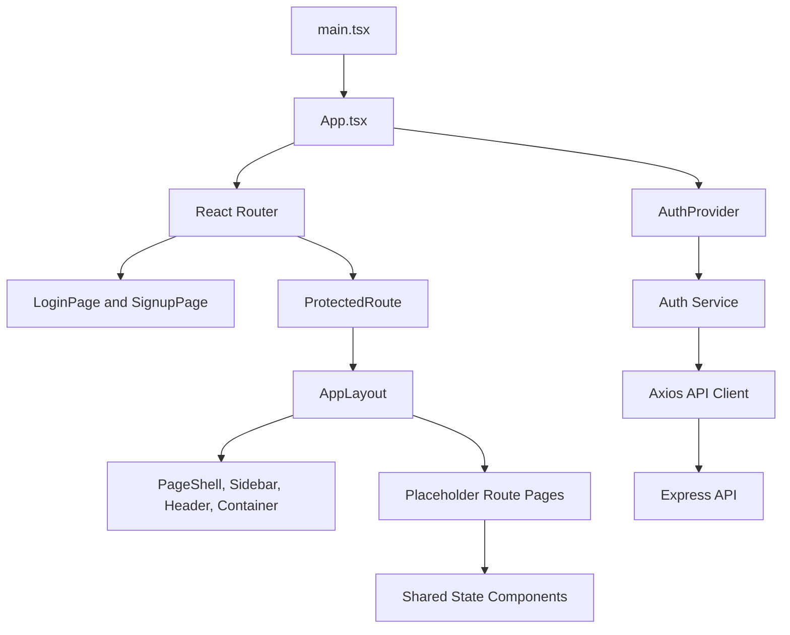
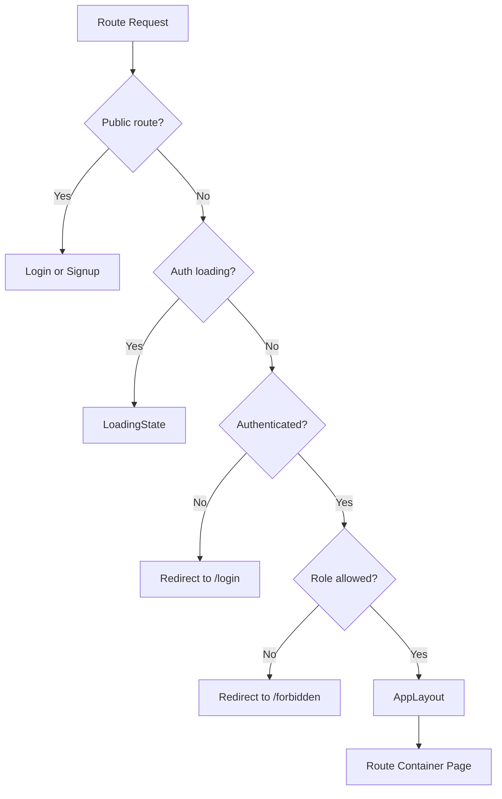
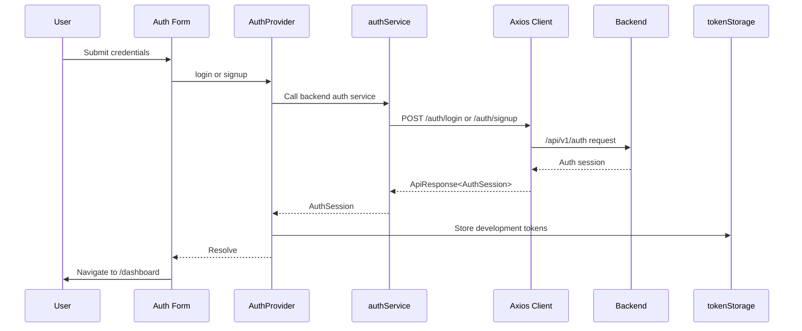
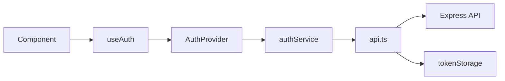

# Supervisor AI Frontend

[](https://react.dev/)
[](https://www.typescriptlang.org/)
[](https://vite.dev/)
[](https://tailwindcss.com/)
[](https://axios-http.com/)

The Supervisor AI frontend is a Vite React application for the authenticated workspace. It currently implements the frontend foundation: brand tokens, app shell, route structure, login/signup screens, auth provider, protected routing, and placeholder workspace pages.

Data-connected dashboards, project management screens, task workflows, employee views, and recommendation review screens are planned but not implemented in the frontend yet.

## Frontend Architecture

The frontend uses route containers, shared layout primitives, feature-owned business logic, and one shared Axios API client.



Architectural decisions:

- Pages stay as route containers.
- Auth logic lives in `features/auth`.
- API communication goes through `src/services/api.ts` and feature services.
- Direct token storage access is isolated to `features/auth/utils/tokenStorage.ts`.
- Reusable UI is built from small typed primitives and design tokens.

## Folder Structure

```txt
src/
  assets/              Static frontend assets.
  components/
    layout/            Shared shell and layout primitives.
    shared/            Loading, error, empty, and placeholder states.
    ui/                Button, Card, and SupervisorLogo primitives.
  features/
    auth/              Auth provider, forms, hooks, guards, service, types.
    ai-recommendations/ Reserved feature directory.
    analytics/         Reserved feature directory.
    employees/         Reserved feature directory.
    projects/          Reserved feature directory.
    tasks/             Reserved feature directory.
  hooks/               Reserved shared hooks directory.
  layouts/             Route layout composition.
  pages/               Route containers only.
  services/            Shared API client.
  store/               Reserved state-management directory.
  styles/              Global design tokens.
  types/               Shared API response types.
  utils/               Reserved shared utilities directory.
```

## Routing

Routes are defined in `src/App.tsx`.

| Route | Access | Current Implementation |
| --- | --- | --- |
| `/login` | Public | Login form connected to backend auth. |
| `/signup` | Public | Signup form connected to backend auth. |
| `/dashboard` | Protected | Placeholder route inside app shell. |
| `/projects` | Protected | Placeholder route inside app shell. |
| `/tasks` | Protected | Placeholder route inside app shell. |
| `/employees` | Protected | Placeholder route inside app shell. |
| `/ai-recommendations` | Protected | Placeholder route inside app shell. |
| `/profile` | Protected | Placeholder route inside app shell. |
| `/forbidden` | Protected | Access restricted placeholder. |
| `*` | Redirect | Redirects to `/dashboard`. |



## Protected Routes

`ProtectedRoute` handles:

- Auth hydration loading state.
- Redirect to `/login` for unauthenticated users.
- Optional role validation.
- Redirect to `/forbidden` when the authenticated role is not allowed.

Current protected workspace roles are `admin`, `supervisor`, and `employee`.

`RoleGuard` is also present as a reusable role-based guard, but the current route tree primarily uses `ProtectedRoute`.

## Authentication Provider

`AuthProvider` is the source of truth for frontend auth state.

It exposes:

- `user`
- `role`
- `isAuthenticated`
- `isLoading`
- `login(credentials)`
- `signup(credentials)`
- `logout()`

On app load, the provider checks for a stored access token and calls `/auth/me`. If the backend validates the token, the user is restored. If validation fails, tokens and auth state are cleared.

Public registration uses `POST /auth/register` to create an organization owner account. Public employee and supervisor signup is intentionally unavailable; those accounts are created through organization invitations. Invitation links use `/invitations/accept?token=…`, inspect with `GET /invitations/:token`, register a new invitee with `POST /invitations/:token/register`, or accept an existing account with `POST /invitations/:token/accept`.

After authentication, the organization provider refreshes `GET /organizations`. It restores only an active saved organization, auto-selects a single active membership, and sends multi-organization users to `/select-organization`.



## API Layer and Services

`src/services/api.ts` configures Axios.

Current behavior:

- Base URL comes from `VITE_API_BASE_URL`.
- Fallback base URL is `/api/v1`.
- Requests attach `Authorization: Bearer <token>` when a token exists.
- `401` responses clear tokens, dispatch a session-expired event, and redirect to `/login`.
- Backend errors are normalized to thrown `Error` objects.

The auth feature service calls:

| Function | Endpoint |
| --- | --- |
| `signup` | `POST /auth/signup` |
| `login` | `POST /auth/login` |
| `getCurrentUser` | `GET /auth/me` |

With the default base URL, those resolve to `/api/v1/auth/*`.



## Services and Hooks

| Layer | Current Files | Responsibility |
| --- | --- | --- |
| Shared API client | `src/services/api.ts` | Axios base URL, auth header, error normalization, 401 handling. |
| Auth service | `src/features/auth/services/authService.ts` | Calls backend auth endpoints and unwraps API responses. |
| Auth context | `src/features/auth/hooks/authContext.ts` | Defines the typed auth context contract. |
| Auth hook | `src/features/auth/hooks/useAuth.ts` | Provides safe component access to auth state and actions. |

Project, task, employee, profile, and recommendation service hooks are planned with their corresponding data-connected feature screens.

## Layout System

The authenticated workspace is composed through `AppLayout`.

| Component | Purpose |
| --- | --- |
| `PageShell` | Responsive shell with sidebar and content column. |
| `Sidebar` | Brand entry point and primary navigation. |
| `Header` | Page title, eyebrow, and actions. |
| `Container` | Max-width content wrapper. |

Current sidebar links:

- Dashboard
- Projects
- Tasks
- Employees
- AI Recommendations
- Profile

## Organization administrator dashboard

Organization administrators use the existing `/dashboard` route. It calls `GET /api/v1/dashboard/supervisor` with the selected organization context and displays only its aggregate project, task, employee-workload, document-analysis, and recommendation data. Use the refresh control to refetch tenant-scoped dashboard data; switching organizations changes the dashboard query key and reloads data for the selected workspace.

## Project list

Authorized organization administrators and supervisors use `/projects`, backed by `GET /api/v1/projects`. The API returns all non-deleted projects for the selected organization and has no filtering, sorting, or pagination parameters. The page stores a client-side title/description search term in `?search=` and reloads safely when the active organization changes. Manual verification: select an organization, open Projects, search by title or description, clear search, refresh, switch organizations, and confirm that only the selected organization’s projects appear.

## Design System

The active design implementation is token-driven and follows a monday/Vibe-inspired purpose-first color model.

| File | Purpose |
| --- | --- |
| `07-logo-final-locked.md` | Locked logo guidance. |
| `08-color-system.md` | Current color token model, palette, and usage rules. |
| `src/styles/tokens.css` | CSS custom properties, purpose aliases, light-theme surfaces, and Tailwind `@theme` exports. |
| `src/index.css` | Tailwind import and global base styles. |

Implemented UI primitives:

| Component | Purpose |
| --- | --- |
| `Button` | Typed button with `primary`, `secondary`, and `ghost` variants. |
| `Card` | Reusable bordered surface. |
| `SupervisorLogo` | Inline Supervisor brand mark and wordmark. |
| `LoadingState` | Shared loading presentation. |
| `ErrorState` | Shared error presentation. |
| `EmptyState` | Shared empty state presentation. |
| `PlaceholderScreen` | Temporary surface for routes without built product UI. |

## State Management

Current state management is intentionally minimal:

- React local state for forms and UI state.
- React context for authentication.
- Browser local storage only through `tokenStorage.ts` for development session persistence.
- No external client state library is installed.

## Build Process

The Vite build is type-checked first:

```bash
npm run build
```

This runs:

```bash
tsc -b && npm exec vite build
```

## Environment Variables

Only variable names are documented. Do not commit real values.

| Variable | Required | Default | Purpose |
| --- | --- | --- | --- |
| `VITE_API_BASE_URL` | No | `/api/v1` | Base URL for the Axios API client. |

The Vite dev server currently proxies `/api` to `http://localhost:4000`. Align this with the backend `PORT` during local development.

## Development Workflow

Install dependencies:

```bash
npm install
```

Run the development server:

```bash
npm run dev
```

Run lint:

```bash
npm run lint
```

Build:

```bash
npm run build
```

Preview a production build:

```bash
npm run preview
```

## Manual authentication verification

1. Owner: open `/signup`, register with email/password, create an organization from `/select-organization`, and confirm the workspace opens at `/dashboard`.
2. New invitee: create an employee or supervisor invitation through the organization invitation flow, open its `/invitations/accept?token=…` link, create a password, and confirm the active membership and dashboard.
3. Existing invitee: open the same link, sign in with the invited email, accept it, and confirm the newly active organization is selected.
4. Restoration: refresh a protected page, confirm `/auth/me` restores the session, sign out, and confirm protected URLs redirect to `/login` with private cached data removed.

## Project details verification

1. Sign in as an organization administrator or supervisor and select an organization.
2. Open `/projects/:projectId` with a project ID from that organization.
3. Confirm the title, description, status, priority, required skills, and created/updated timestamps match `GET /api/v1/projects/:projectId`.
4. Refresh the details, switch organizations, and confirm the previous organization’s project data is not displayed.
5. Verify missing or inaccessible projects show a safe state, then resize to tablet and mobile widths to confirm the metadata and skills wrap without overflow.

## Frontend Roadmap

| Status | Item |
| --- | --- |
| Done | Vite, React, TypeScript, and Tailwind foundation. |
| Done | Locked brand tokens and Supervisor logo component. |
| Done | Responsive app shell and navigation. |
| Done | Login and signup pages. |
| Done | Backend-integrated auth provider and session restore. |
| Done | Protected routes and forbidden route placeholder. |
| Planned | Data-connected dashboard. |
| Planned | Project, task, employee, profile, and recommendation feature screens. |
| Planned | Frontend services and hooks for project/task/employee APIs. |
| Planned | Role-specific frontend experiences. |
| Planned | Automated frontend tests. |
| Planned | Production deployment configuration. |
