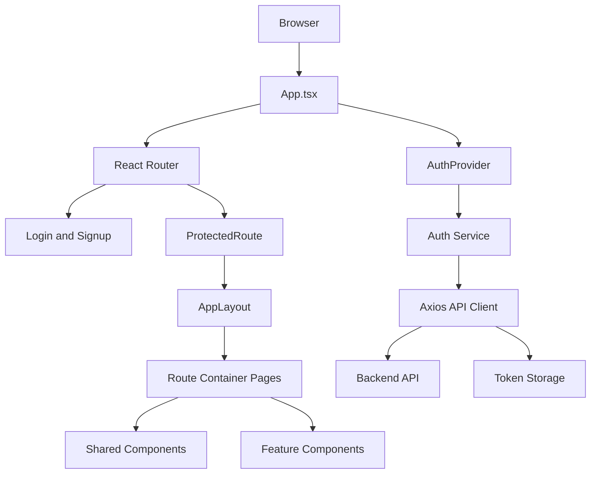
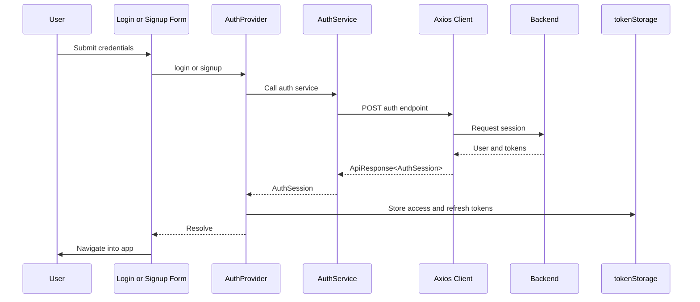
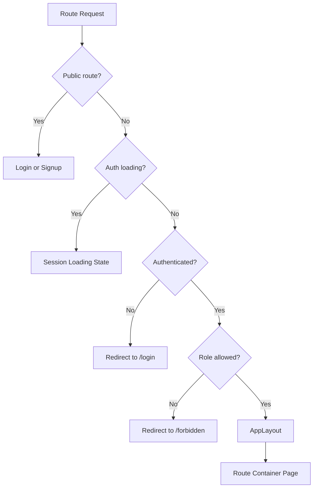

# Supervisor AI Frontend

[](https://react.dev/)
[](https://www.typescriptlang.org/)
[](https://vite.dev/)
[](https://tailwindcss.com/)
[](https://axios-http.com/)

Supervisor AI is a React frontend for an authenticated supervisor workspace. The current implementation provides the application foundation: a branded shell, route structure, reusable UI primitives, backend-backed authentication, session restoration, protected routes, and placeholder workspace pages for the next product phases.

This README documents the frontend as it exists today. Dashboard, project, task, employee, AI recommendation, and profile business workflows are intentionally not implemented yet.

## Screenshots

> Screenshot assets are placeholders until the product screens are finalized.

| Login | App Shell |
| --- | --- |
| `docs/screenshots/login.png` | `docs/screenshots/app-shell.png` |

## Current Status

Implemented:

- Vite, React, TypeScript, and Tailwind CSS foundation.
- Locked Supervisor AI color tokens and logo component.
- Responsive application shell with sidebar navigation and header.
- Public login and signup screens.
- Backend-integrated authentication for signup, login, session restore, and logout.
- Axios API client with authorization header injection and 401 handling.
- Protected routes and role-aware route checks for `admin`, `supervisor`, and `employee`.
- Placeholder route containers for dashboard and workspace sections.

Not implemented yet:

- Real dashboard analytics.
- Project, task, employee, profile, and AI recommendation data flows.
- Production-grade refresh-token rotation.
- Automated test suite.

## Tech Stack

| Area | Tooling |
| --- | --- |
| UI | React 19 |
| Language | TypeScript 6, strict mode |
| Build | Vite 8 |
| Routing | React Router 7 |
| Styling | Tailwind CSS 4 with CSS design tokens |
| HTTP | Axios |
| Linting | ESLint 10 |

## Setup

Install dependencies:

```bash
npm install
```

Start the frontend dev server:

```bash
npm run dev
```

By default, the Vite dev server proxies `/api` requests to the backend at `http://localhost:4000`. Start the backend separately before testing login, signup, or session restoration.

Build for production:

```bash
npm run build
```

Preview a production build:

```bash
npm run preview
```

## Environment Variables

The frontend reads environment variables through Vite. Create `.env.local` in this directory when local overrides are needed.

| Variable | Required | Default | Description |
| --- | --- | --- | --- |
| `VITE_API_BASE_URL` | No | `/api/v1` | Base URL used by the Axios client. In local development, `/api/v1` is proxied by Vite to `http://localhost:4000/api/v1`. |

Example using the Vite proxy:

```env
VITE_API_BASE_URL=/api/v1
```

Example using a direct backend URL:

```env
VITE_API_BASE_URL=http://localhost:4000/api/v1
```

## Development Scripts

| Command | Description |
| --- | --- |
| `npm run dev` | Start the Vite development server. |
| `npm run build` | Type-check the project and create a production build. |
| `npm run lint` | Run ESLint against `src`. |
| `npm run preview` | Serve the production build locally. |

## Architecture

The frontend is organized around small route containers, feature-level business logic, shared layout primitives, and a single API client. Pages remain thin and compose feature components, layout, and shared UI rather than owning data-fetching or authentication logic directly.



### Architecture Decisions

- Route files stay as containers. They compose components and do not own backend integration.
- API calls go through `src/services/api.ts` and feature services.
- Authentication state is centralized in `AuthProvider`; components use `useAuth()`.
- Direct token storage access is isolated to `features/auth/utils/tokenStorage.ts`.
- UI primitives are small, typed, accessible, and styled with design tokens.
- The shell and placeholder pages exist to validate routing, layout, and auth before product workflows are built.

## Backend Communication

The shared Axios client lives in `src/services/api.ts`.

It currently:

- Uses `import.meta.env.VITE_API_BASE_URL` with `/api/v1` as the fallback.
- Sends JSON requests.
- Reads the stored access token and attaches `Authorization: Bearer <token>`.
- Normalizes backend error responses into thrown `Error` instances.
- Handles `401 Unauthorized` by clearing stored tokens, dispatching a session-expired event, and redirecting to `/login`.

The authentication service in `src/features/auth/services/authService.ts` calls:

| Method | Endpoint | Purpose |
| --- | --- | --- |
| `POST` | `/auth/signup` | Create a user session after signup. |
| `POST` | `/auth/login` | Authenticate and return a session. |
| `GET` | `/auth/me` | Restore the current authenticated user. |

With the default base URL, these resolve to:

- `POST /api/v1/auth/signup`
- `POST /api/v1/auth/login`
- `GET /api/v1/auth/me`

## Authentication Flow

Authentication is implemented in `src/features/auth`.

`AuthProvider` exposes:

- `user`
- `role`
- `isAuthenticated`
- `isLoading`
- `login(credentials)`
- `signup(credentials)`
- `logout()`

On refresh, the provider checks for an access token and calls `/auth/me`. If the token is valid, the user is restored. If the token is missing or invalid, the session is cleared and protected routes redirect to `/login`.



Logout clears auth state, removes stored tokens, and redirects to `/login`.

## Routing

Routes are defined in `src/App.tsx`.

| Route | Access | Current Implementation |
| --- | --- | --- |
| `/login` | Public | Login screen. |
| `/signup` | Public | Signup screen. |
| `/dashboard` | Protected | Placeholder dashboard route. |
| `/projects` | Protected | Placeholder projects route. |
| `/tasks` | Protected | Placeholder tasks route. |
| `/employees` | Protected | Placeholder employees route. |
| `/ai-recommendations` | Protected | Placeholder AI recommendations route. |
| `/profile` | Protected | Placeholder profile route. |
| `/forbidden` | Protected | Access restricted placeholder. |
| `*` | Redirect | Redirects to `/dashboard`. |

Protected workspace routes currently allow `admin`, `supervisor`, and `employee` roles. Role-specific business behavior has not been implemented yet.



## Design System

The design system is token-driven and based on the locked Supervisor AI brand documentation:

- `07-logo-final-locked.md`
- `08-color-system.md`

The active implementation lives in:

- `src/styles/tokens.css`
- `src/index.css`
- `src/components/ui`
- `src/components/layout`
- `src/components/shared`

The token layer defines brand blues, expressive accent colors, semantic status colors, neutral scales, surfaces, borders, shadows, and dark-mode values. Tailwind CSS consumes these tokens through `@theme`, allowing components to use semantic classes such as `bg-surface-page`, `text-ink-900`, `border-border-subtle`, and `text-brand-700`.

Reusable UI primitives currently include:

| Component | Purpose |
| --- | --- |
| `Button` | Typed button primitive with `primary`, `secondary`, and `ghost` variants. |
| `Card` | Small surface primitive for grouped content. |
| `SupervisorLogo` | Brand logo component using the locked symbol geometry and wordmark treatment. |
| `LoadingState` | Shared loading display. |
| `ErrorState` | Shared error display. |
| `EmptyState` | Shared empty-state display. |
| `PlaceholderScreen` | Temporary content surface for not-yet-built pages. |

Layout primitives currently include:

| Component | Purpose |
| --- | --- |
| `PageShell` | Responsive application frame with sidebar and header. |
| `Sidebar` | Primary navigation and brand entry point. |
| `Header` | Page title, eyebrow, and action area. |
| `Container` | Responsive content width and page padding. |

## Folder Structure

```txt
src/
  assets/              Static frontend assets.
  components/
    layout/            Shared shell and layout primitives.
    shared/            Reusable loading, error, empty, and placeholder states.
    ui/                Low-level reusable UI primitives and brand components.
  features/
    auth/              Authentication provider, hooks, forms, guards, services, and types.
    ai-recommendations/ Reserved feature directory.
    analytics/         Reserved feature directory.
    employees/         Reserved feature directory.
    projects/          Reserved feature directory.
    tasks/             Reserved feature directory.
  hooks/               Reserved shared hooks directory.
  layouts/             Route layout composition.
  pages/               Route containers only.
  services/            Shared API client.
  store/               Reserved state-management directory.
  styles/              Global design tokens.
  types/               Shared API response types.
  utils/               Reserved shared utilities directory.
```

## API, Services, Hooks, and Provider

The current frontend separates responsibilities as follows:

| Layer | Files | Responsibility |
| --- | --- | --- |
| API client | `src/services/api.ts` | Axios configuration, base URL, auth header, error handling, 401 redirect behavior. |
| API types | `src/types/api.ts` | Shared API response and pagination contracts. |
| Auth service | `src/features/auth/services/authService.ts` | Backend auth endpoint calls and response unwrapping. |
| Auth provider | `src/features/auth/components/AuthProvider.tsx` | Session state, session hydration, login, signup, logout. |
| Auth hook | `src/features/auth/hooks/useAuth.ts` | Public component access to auth context. |
| Token storage | `src/features/auth/utils/tokenStorage.ts` | Local development token persistence and session-expired event dispatch. |
| Route guards | `ProtectedRoute.tsx`, `RoleGuard.tsx` | Authentication and role validation boundaries. |

## Project Philosophy

The frontend is being built incrementally. Each phase should leave the app runnable, typed, and aligned with the existing architecture before new product behavior is added.

Guiding principles:

- Build only the current phase of functionality.
- Keep pages thin and feature logic colocated.
- Use shared services for backend communication.
- Keep auth state behind a provider and hook.
- Prefer semantic design tokens over one-off colors.
- Preserve accessible focus states and responsive behavior in shared primitives.
- Avoid mock user flows when real backend endpoints exist.

## Roadmap

| Status | Item |
| --- | --- |
| Done | Frontend foundation with Vite, React, TypeScript, and Tailwind CSS. |
| Done | Locked brand color tokens and logo component. |
| Done | Responsive app shell and temporary navigation. |
| Done | Login and signup screens. |
| Done | Backend-integrated authentication and session restoration. |
| Done | Protected routes and role-aware guard placeholders. |
| Planned | Real dashboard data and analytics. |
| Planned | Project, task, and employee workflows. |
| Planned | AI recommendation review experience. |
| Planned | Profile management. |
| Planned | Role-specific application behavior. |
| Planned | Automated tests. |
| Planned | Production deployment hardening. |

## Contributing Notes

Before changing frontend behavior, review `CODEX.md`, `07-logo-final-locked.md`, and `08-color-system.md`. Keep new pages as route containers, place business logic in feature folders, and route backend communication through services.

Run these before opening a change:

```bash
npm run build
npm run lint
```
